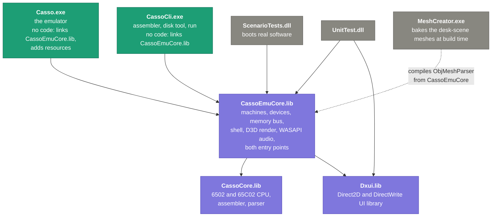
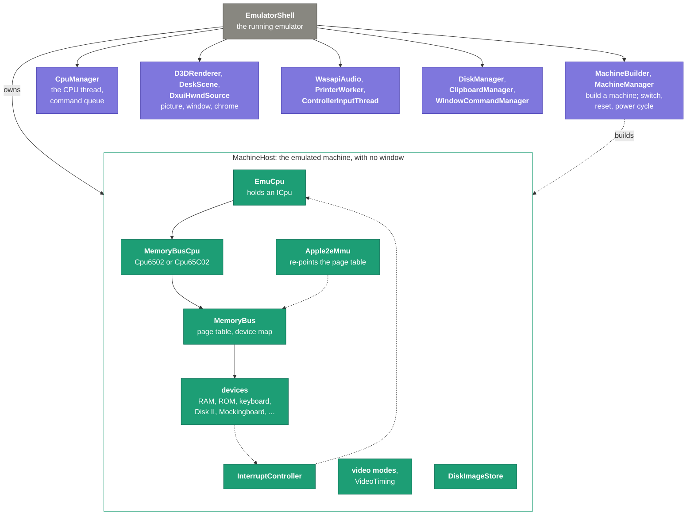
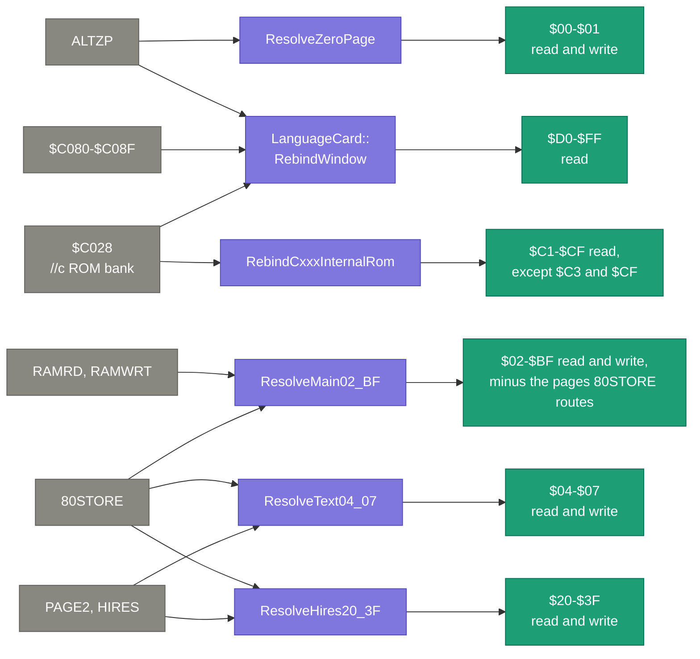
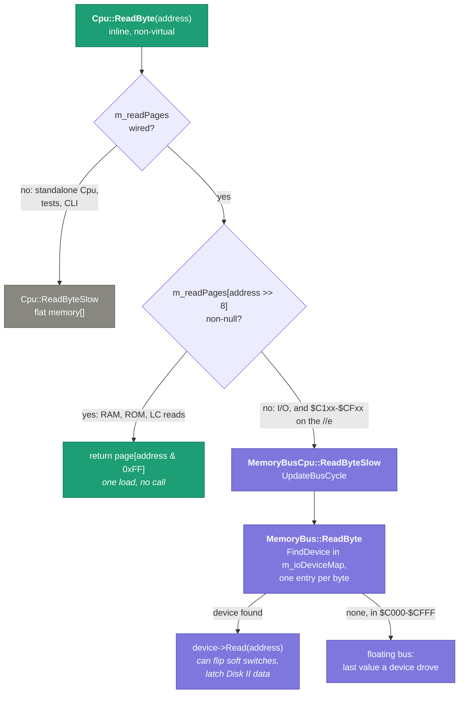
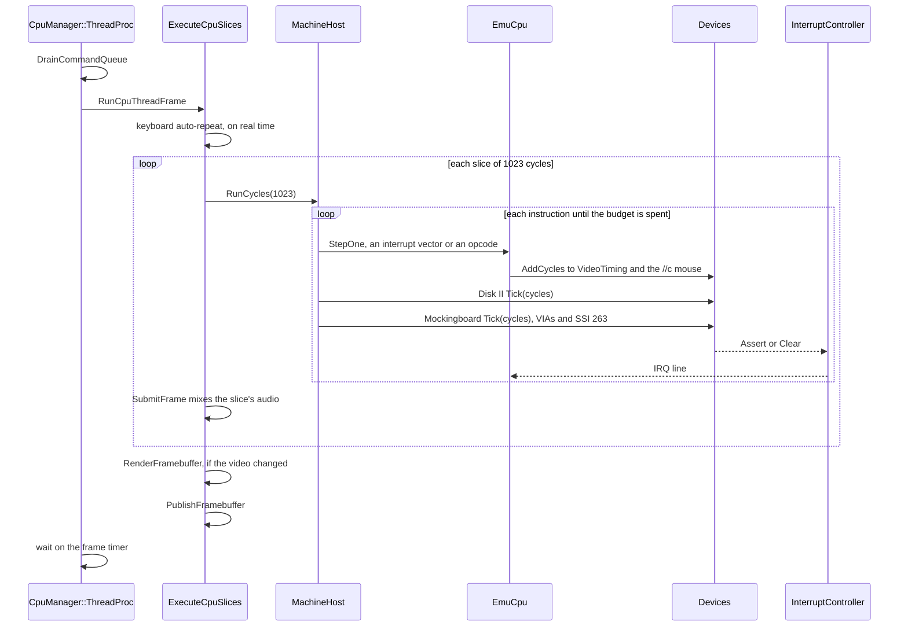
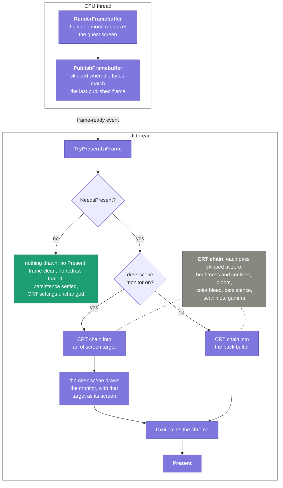
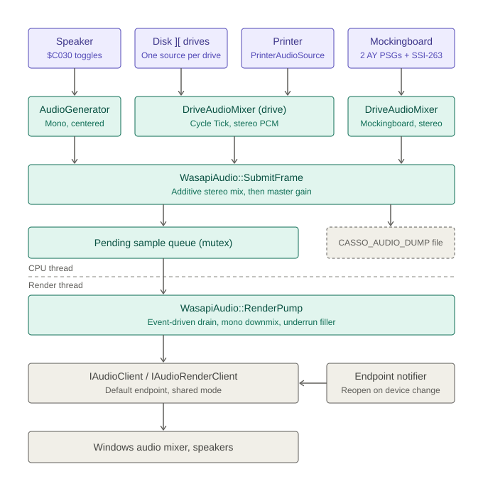
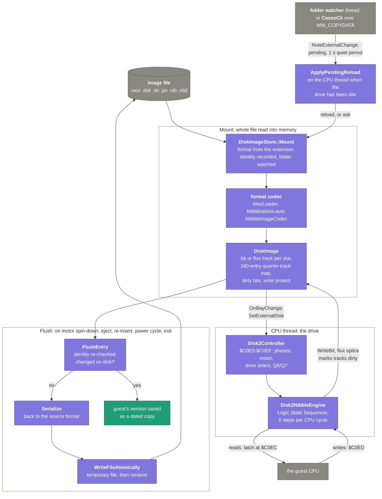

# Casso Architecture

How Casso is built, how the pieces fit at runtime, and (because it emulates a
1 MHz machine on a modern host and has to stay cheap doing it) **why the hot
paths are shaped the way they are**. If you are about to touch the memory bus,
the CPU fetch path, the device tick loop, or the render pipeline, read the
relevant section first; the performance model is load-bearing, not incidental.

For code style, EHM conventions, and build/merge gates see
[`.github/copilot-instructions.md`](.github/copilot-instructions.md). For the
per-feature design history see `specs/`. For the //e hardware-fidelity rationale
see [`specs/004-apple-iie-fidelity/iie-audit.md`](specs/004-apple-iie-fidelity/iie-audit.md)
(historical: the work it drove is done; the code cites it by section number).

---

## Contents

1. [Projects and layering](#1-projects-and-layering)
2. [Threading model](#2-threading-model)
3. [The memory model](#3-the-memory-model): the centerpiece
4. [CPU fetch / execute](#4-cpu-fetch--execute)
5. [Devices and the per-instruction tick](#5-devices-and-the-per-instruction-tick)
6. [Video and the render / present pipeline](#6-video-and-the-render--present-pipeline)
7. [Audio](#7-audio)
8. [Disks](#8-disks)
9. [Performance decisions log](#9-performance-decisions-log)
10. [Roads not taken](#10-roads-not-taken)
11. [Where to look](#11-where-to-look)

---

## 1. Projects and layering

Eight projects in `Casso.sln`. Three static libraries hold all of the code; the
two executables have none of their own, and the rest are tests and a build
tool:


| Project | Builds | Contents |
|---|---|---|
| **CassoCore** | `CassoCore.lib` | 6502/65C02 CPU, microcode/opcode tables, assembler, parser |
| **Dxui** | `Dxui.lib` | Direct2D/DirectWrite UI library: windows, panels, layout, text |
| **CassoEmuCore** | `CassoEmuCore.lib` | machines, devices, memory bus, MMU, video modes, audio generators; also the shell, D3D11 rendering, WASAPI output, and both entry points |
| **Casso** | `Casso.exe` | no code: links `CassoEmuCore.lib` and adds the resources |
| **CassoCli** | `CassoCli.exe` | no code: links `CassoEmuCore.lib` for the assembler, disk tool and `run` |
| **UnitTest** | `UnitTest.dll` | MS Native CppUnitTest; links all three libraries |
| **ScenarioTests** | `ScenarioTests.dll` | boots real software and checks its guest-visible results |
| **MeshCreator** | `MeshCreator.exe` | bakes the desk scene's OBJ models into the blobs the emulator loads; runs at build time |

The dependency arrows only point downward. `CassoCore` depends on nothing, which
is why the CPU can be driven headless by tests and by the CLI, and it is the
reason one specific optimization (the inline read fast path, §4) is careful
**not** to leak emulator types back up into `CassoCore`; see
[Roads not taken](#10-roads-not-taken). `CassoEmuCore` holds the Win32, D3D and
WASAPI code as well as the emulation: the library split exists so `UnitTest`
can link the shell and renderer, not to keep the platform out.

The runtime object graph in the GUI:



`EmuCpu` is the `ICpu` wrapper the machine holds; underneath it is a
`MemoryBusCpu` (a `Cpu6502`/`Cpu65C02` strategy that routes memory through the
`MemoryBus` instead of a flat array). Tests substitute a flat-memory `TestCpu` /
`TestCpu65C02` at the same seam.

---

## 2. Threading model

Two threads own the emulator's state:

- **The emulation (CPU) thread**: `CpuManager::ThreadProc`. It drains a command
  queue (`DrainCommandQueue`), runs CPU slices (`ExecuteCpuSlices`), ticks the
  cycle-driven devices, and produces the video framebuffer. Everything that
  touches CPU / bus / device state runs here.
- **The UI thread**: `EmulatorShell::RunMessageLoop`. It pumps Win32 messages,
  paints the chrome (the Dxui panel tree), and presents via D3D. The Dxui panel
  tree is **single-threaded and UI-thread-affine** (enforced by
  `DxuiAssertUiThread`, ~154 call sites), so anything that mutates a panel or
  measures text must run here.

Four more long-lived threads each do one narrow job:

- **Audio render**: `WasapiAudio::RenderPump` drains the pending sample queue
  into WASAPI (see §7).
- **Controller input**: `ControllerInputThread` reads game controllers, waiting
  on DirectInput's change events, or on a timeout while an XInput controller is
  selected.
- **Printer**: `PrinterWorker` paces `PrinterEngine::Tick` against the wall
  clock.
- **Disk image watcher**: `Win32ImageWatcher` runs one thread per directory
  holding a mounted image, so Casso detects an external rewrite of the image.

<p align="center"></p>

Short-lived threads come and go for the first-run downloads
(`StartupDownloadDialog`) and for Print to PDF, which needs an MTA
(`WindowCommandManager`).

**A running Casso shows well over 100 threads, and almost none are Casso's.**
On a 32-thread Ryzen with an NVIDIA GPU, 103 of 116 started in `nvwgf2umx.dll`,
all at one entry point: the D3D11 user-mode driver's worker pool. The rest are Casso's own six, a few Windows thread-pool
workers, and one each for COM, DirectInput and the input host.

**Command routing** (get this wrong and you trip `DxuiAssertUiThread`):

- UI-layout commands → `PostMessage(WM_COMMAND)` → handled on the UI thread.
- Emulation / audio commands → `PostCommand` → the CPU thread's
  `DispatchCpuCommand` (machine switch, reset, power-cycle, step, disk ops).

Because `SwitchMachine` runs on the CPU thread, any UI work it needs is marshaled
back to the UI thread with a posted message (`WM_APP_DXUI_UPDATE_TITLE` → title
refresh + `ReflowChromeForMachineChange`). This is the canonical pattern for
"CPU thread needs to touch chrome."

**Frame handoff.** The CPU thread renders the guest screen into a framebuffer and
signals the UI thread (`m_frameReadyEvent` / `PublishFramebuffer`); the UI thread
uploads and presents. The CPU thread does **not** touch D3D or the panel tree.

---

## 3. The memory model

This is where most of the performance lives, and the design mirrors the //e
hardware more closely than it first looks.

### 3.1 What the hardware actually does

There is no lookup table in the machine. The //e's **MMU** and **IOU** chips
decode the 16 address lines plus the current **soft-switch latch state**,
combinationally, every cycle, to drive exactly one chip's select line:

- `$0000–$BFFF` → main or aux DRAM (per RAMRD/RAMWRT/ALTZP/80STORE/PAGE2/HIRES)
- `$C000–$CFFF` → I/O strobes (IOU/MMU soft switches) or slot/internal ROM
- `$D000–$FFFF` → motherboard ROM or language-card RAM (per the LC latches)

The soft switches are latches; the decode is a pure function of
`(address, latches)`. Some accesses *also* toggle a latch; that is the "side
effect," and it is just the chip reacting to being addressed.

### 3.2 The software model: two lanes, memoizing the decode

Running the full decode on every one of the millions of accesses per second
would be too slow. But the decode result only changes when a latch changes, so
Casso **precomputes and caches it**, re-deriving only on soft-switch writes. That
cache is the page table, and it splits along a real hardware distinction:

| Lane | Answers | Structure | For |
|---|---|---|---|
| **Page table** | "where is the byte?" → `Byte*`, one load, no call | `m_readPage[0x100]` / `m_writePage[0x100]` (per-page) | passive storage chips (RAM, ROM) |
| **Device map** | "which chip do I call?" → `MemoryDevice*`, then a virtual `Read`/`Write` | `m_ioDeviceMap` (byte-granular, `$C000–$FFFF`) | reactive chips (I/O, computed values) |

`MemoryBus::ReadByte` is uniform: `page = m_readPage[addr>>8]; if (page) return
page[addr&0xFF]; else dispatch to the device`. Writes are the same with
`m_writePage`. The read path has no `address <` special-casing; a page is either
a pointer (fast) or null (fall through to the device).

The two granularities are not a wart; they are faithful. **Memory decode is
coarse** (RAM/ROM are page/bank aligned → a 256-entry page table suffices).
**I/O decode is fine** (page `$C0` packs several overlapping sub-page devices (
keyboard `$C000–$C063`, speaker `$C030–$C03F`, soft switches `$C050–$C07F`, LC
control `$C080–$C08F`, disk `$C0E0–$C0EF`) so the device map must be
byte-granular). The device map resolves overlaps **first-match-wins** (entries
sorted by start), which is why it is precomputed from the device list rather than
scanned per access (`BuildIoDeviceMap`, rebuilt only on `AddDevice`/`RemoveDevice`).

### 3.3 Passive vs reactive pages: what is mapped where

A page gets a **page-table pointer** iff the chip that answers there is passive
storage; it stays on the **device handler** iff the chip reacts to being
addressed (side effects, computed reads):

<p align="center"></p>

| Range | Nature | Lane |
|---|---|---|
| `$0000–$BFFF` | main/aux RAM | page table (read + write) |
| `$C000–$CFFF` | I/O: soft switches, floating bus, disk, slots | **device map** (side effects) |
| `$C100–$CFFF` (//c) | static internal firmware, *except* `$C3xx`/`$CFFF` | page table (read); `$C3`/`$CF` stay device (INTC8ROM side effects) |
| `$D000–$FFFF` | ROM or LC RAM | page table (read); writes stay device |

Notes:

- **Writes to ROM/LC (`$D000–$FFFF`, `$C1xx`)** are left on the device path. The
  language card's WRITERAM gating and two-read pre-write arm are stateful and
  belong in the device; reads and writes still resolve to the *same* buffer, so
  they stay coherent (read-ROM/write-RAM works because the read page points at
  ROM while the write goes to the hidden RAM).
- The reactive `$Cxxx` pages (`$C3xx` latches INTC8ROM, `$CFFF` clears it) keep
  the handler even on the //c where the effect is inert, modeled faithfully as
  "reactive page → handler."

### 3.4 Re-pointing: keeping the cache correct

Because the page table is a *cache* of the decode, it must be rebuilt whenever a
latch that affects it changes. Each switch re-resolves only the pages it
affects:


- **RAMRD, RAMWRT** → `ResolveMain02_BF` re-points `$02–$BF`, skipping the
  pages 80STORE routes.
- **80STORE** → `ResolveMain02_BF`, `ResolveText04_07` and `ResolveHires20_3F`.
- **PAGE2, HIRES** → `OnSoftSwitchChanged`, which runs `ResolveText04_07` and
  `ResolveHires20_3F`.
- **ALTZP** → `ResolveZeroPage`, **and** `LanguageCard::RebindWindow`, because
  the language card's RAM moves between main and aux with it.
- **LC bank/read switches (`$C08x`)** → `LanguageCard::RebindWindow` re-points
  the `$D0–$FF` read pages (bank 1 or 2, main or aux, or ROM).
- **//c `$C028` bank flip** → `RebindCxxxInternalRom` re-points `$C1–$CF`, and
  `RebindWindow` re-points `$D0–$FF`. Both matter because `SetInternalRom`
  move-reassigns its buffer, so stale pointers would dangle.
- **Reset, power cycle** → `RebindPageTable` runs all four RAM resolvers.
- **INTCXROM, SLOTC3ROM, INTC8ROM** re-point nothing: `CxxxRomRouter` checks
  them on every access, which is why `$C1xx–$CFxx` stays on the device path on
  the //e.

Miss a re-point and you serve stale bytes; that is the one real hazard of this
design, so the trigger set above is the thing to preserve when changing banking.

---

## 4. CPU fetch / execute

`Cpu::StepOne` fetches an opcode, indexes the microcode table, and runs the
addressing-mode + operation. The hot part is the memory read.

**`Cpu::ReadByte` is a non-virtual inline fast path.** It indexes an optional
page table directly and only falls through a virtual `ReadByteSlow` hook for
null pages:

```cpp
Byte ReadByte (Word address) {
    if (m_readPages != nullptr) {
        Byte* page = m_readPages[address >> 8];
        if (page != nullptr) return page[address & 0xFF];  // RAM + ROM/LC
    }
    return ReadByteSlow (address);   // I/O ($C000–$CFFF) + unmapped
}
```

`m_readPages` is a `Byte* const*` pointing at the bus's `m_readPage[256]` array.
Crucially it is a bare pointer-to-pointers, `CassoCore` knows nothing about
`MemoryBus`. `MemoryBusCpu` overrides `ReadByteSlow` to route the slow path
through the bus (I/O device dispatch). The standalone base `Cpu` leaves
`m_readPages` null and always takes the slow path into its flat `memory[]`.



`ReadByteSlow` (for I/O) calls `UpdateBusCycle`, which refreshes the
sub-instruction bus-cycle estimate the Disk II controller samples at `$C0Ex`.
It is **absolute** (`m_busCycle = m_totalCycles + (lastCycles-1)`), re-derived at
each access, so RAM and ROM fetches, which take the fast path and skip it, cause
no drift (the `$C0Ex` access itself, always a slow-path I/O read, refreshes it).

**65C02.** `Cpu65C02` shares the dispatch and adds the CMOS instructions
(`BRA`, `PHX/PHY/PLX/PLY`, `STZ`, `TRB`, `TSB`, `BIT #imm`, fixed BCD). Both cores
pass Klaus Dormann's functional tests and Tom Harte's SingleStepTests (10,000
vectors/opcode) including the stable undocumented NMOS opcodes; those suites are
the gate for any change on this path.

---

## 5. Devices and the per-instruction tick

Devices implement `MemoryDevice` (`Read`/`Write`/`GetStart`/`GetEnd`) and register
on the `MemoryBus`. The CPU thread runs each frame as slices of 1,023 cycles,
and each slice one instruction at a time; after every instruction the
cycle-driven devices get that instruction's cycle count:


- **`VideoTiming`**, and on the //c the **`AppleMouse`**, ride
  `EmuCpu::AddCycles`. The mouse is an `ICycleSink` wired through
  `SetCycleSink`.
- **The Disk II controller and the Mockingboard** are ticked by
  `MachineHost::StepOne`. The Disk II `Tick` runs the motor timers, and it fires
  the motor-off flush and the idle check for external changes (§8); the nibble
  engine itself catches up to the CPU when the CPU reads `$C0Ex`
  (`CatchUpToCpu`).
- **Keyboard auto-repeat** runs once per frame on real time
  (`TickAutoRepeat`), not per instruction; only the reset-key hold is counted
  in cycles, once per slice (`TickResetHold`).
- **Audio** is mixed once per slice by `WasapiAudio::SubmitFrame`, which also
  ticks the drive mixer.
- **The printer** is not ticked by the CPU at all; the printer thread paces it
  against the wall clock (§2).

`Apple2eMmu` is not a bus device; it is a **coordinator** that owns the aux
RAM and re-points the page table on banking changes (§3.4). It owns the
`CxxxRomRouter` (which it registers on the bus).

**The tick is a hot loop, so idle work is gated.** The pattern: do the expensive
thing only when it can matter.

- **Mockingboard**: `Ay8910::GenerateSample` early-outs when all amplitude
  registers are zero (`IsSilent`); a silent PSG does no synthesis.
- **`AppleMouse::Tick`** (the //c's biggest single cost before gating), drains
  host motion behind a **relaxed atomic load** so the common idle tick pays no
  locked read-modify-write, and only calls `UpdateIrqLines` when a latch actually
  changed this tick.

Interrupts aggregate through `InterruptController` (level-sensitive sources:
the Mockingboard VIAs, the //c mouse's X/Y and VBL, the 6551 ACIA), which drives
the CPU IRQ line.

---

## 6. Video and the render / present pipeline



**Frame production (CPU thread).** Video modes (`AppleTextMode`,
`Apple80ColTextMode`, `AppleLoResMode`, `AppleHiResMode`,
`AppleDoubleHiResMode`) rasterize the guest screen from the display pages into a
framebuffer. Flash and mode timing come from the cycle-driven `VideoTiming`, not
from the render. `RenderFramebuffer` runs only when something the picture
depends on changed (`FramePacing::NeedsRender`: video dirty, mode, flash phase,
color), and `PublishFramebuffer` hands the frame to the UI thread only when its
bytes differ from the last frame published.

**Dirty tracking; don't re-rasterize an unchanged screen.** The `MemoryBus`
marks the display pages "watched"; a write that actually *changes a displayed
byte* raises `m_videoDirty`. Two refinements keep an idle DOS prompt from
re-rendering: **screen-hole exclusion** (the `$78–$7F` bytes of each 128-byte
block are undisplayed scratch that firmware hammers) and a **same-value compare**
(a re-store of the same byte is not dirty). A banking change from PAGE2, HIRES
or DHIRES also raises dirty, since it can change what the screen shows with no
write landing.

**Present gating (GPU), present on change.** `D3DRenderer::NeedsPresent` returns
false (skip both the CRT post-process and the swap-chain `Present`) when the
framebuffer is clean, no redraw is forced, CRT params are unchanged, and the
persistence trail has settled. So a static screen costs ~no GPU. When a present
*is* needed, `DxuiRenderTarget::RenderFrame` draws the picture before the
chrome. Normally `UploadAndComposite` maps the framebuffer into a texture and
`RenderCrtFrame` runs the CRT post-process into the back buffer. With the desk
scene's monitor on, `UploadAndCompositeOffscreen` runs the same chain into an
offscreen target and the desk scene draws the 3D monitor with that target as its
screen. The CRT chain's passes run in order, each skipped at zero: brightness and
contrast, bloom, color bleed, persistence, scanlines, gamma.

**Chrome.** The drive band, `//c` switch bar, buttons, and letterbox are painted
by the Dxui panel tree on the UI thread, immediate-mode, re-tessellated each
presented frame (`DxuiPainter::PushQuad`). This is the current largest CPU render
cost, the perf facet of the off-thread-compositing initiative (#100; see §10).

---

## 7. Audio

The generators (speaker delta-sigma, Disk II and printer mechanical sound,
Mockingboard PSGs and speech) produce PCM from cycle-timestamped events on the
CPU thread, and `WasapiAudio::SubmitFrame` mixes them into a pending sample
queue. A dedicated render thread, `WasapiAudio::RenderPump`, drains that queue
into WASAPI whenever the endpoint signals it has room. `SubmitFrame` is
**non-blocking** (it drops rather than blocks, capped at a 3-frame backlog) so
audio buffer pressure never throttles the emulation thread. (Emulation speed is
governed by the frame pacing in the CPU-thread loop, not by audio.)

<p align="center"></p>

---

## 8. Disks


**Mount: the whole file, read once.** A mount reads the image file into memory
and closes it; nothing holds the file open while Casso runs. The format comes
from the extension. `NibblizationLayer` turns a `.dsk`, `.do` or `.po` into
GCR-encoded tracks (6-and-2, in DOS 3.3 or ProDOS sector order), `WozLoader`
loads WOZ 1 and 2 bit tracks and WOZ 2.1 flux tracks, and `NibbleImageCodec`
loads `.nib` and `.nb2` as raw nibbles. Each produces one `DiskImage`: a bit or
flux track per slot, and a 160-entry map from quarter-track head position to
slot. The store records the file's identity (size and last-write time) and
watches its folder.

**The drive catches up when it is read.** The nibble engine does not advance on
every instruction. When the CPU touches `$C0Ex`, `Disk2Controller::CatchUpToCpu`
runs the active drive's `Disk2NibbleEngine` forward to the CPU's bus cycle, two
sequencer steps per CPU cycle, through the P6 Logic State Sequencer ROM and the
MC3470 read amplifier's weak bits. The latch at `$C0EC` is what the CPU reads.
Between accesses the engine does no work, so an idle drive costs nothing.

**Writes stay in memory until the motor stops.** A write goes through the same
sequencer into `DiskImage::WriteBit` on a bit track, or into a buffered burst
that is spliced into a flux track, and marks the track dirty. Nothing reaches
the file yet. The file is written when the motor spins down (1,000,000 cycles,
about a second, after `$C0E8`), and on eject, re-insert, power cycle, machine
switch and exit.

**A flush checks the file first.** `FlushEntry` re-reads the file's identity
before writing. If it changed since the mount, another program wrote it: the
guest's version goes to a dated copy beside it, the drive moves to that copy,
and the other program's file is left alone. Otherwise the image serializes back
to its own format, and `WriteFileAtomically` writes a temporary file beside the
target and renames it over. A sector image whose guest data no longer decodes
as 16 clean sectors is not overwritten; the session is saved as a
`.recovered.woz` instead.

**External changes are picked up when the drive is idle.** The folder watcher
thread, and `CassoCli` reporting over `WM_COPYDATA` that it rewrote a mounted
disk, both call `NoteExternalChange`, which only records the change. Once a
second passes with no further change, the CPU thread acts on it at its next
idle point (no motor spin-up for 17,030 cycles) through `ApplyPendingReload`:
it reloads the disk in place, reboots, or asks, depending on what the writer
asked for and whether the guest has unsaved writes.
[docs/disk-write-integrity.md](docs/disk-write-integrity.md) has the full
rules.

---
## 9. Performance decisions log

Each entry: the problem → the fix → *why this shape*. Newest first. Rationale
also lives in the commit messages; this is the durable summary.

| Area | Problem | Fix | Why |
|---|---|---|---|
| **`$C100–$CFFF` fetch (//c)** | mouse firmware runs from `$C700` through `CxxxRomRouter::Read`'s virtual dispatch every byte | page-map the passive internal-ROM pages into `m_readPage`; keep `$C3`/`$CF` on the handler | reactive pages need the handler; passive ROM wants a pointer |
| **`$D000–$FFFF` fetch** | ROM/LC fetches (e.g. //e monitor keyboard poll at `$FDxx`) paid `LanguageCardBank::Read`'s virtual dispatch every byte | page-map the LC window; re-point on bank/read/ALTZP/`$C028` changes | it's memory with no read side effects, belongs in the fast lane |
| **`$Cxxx` routing** | `Apple2eMmu` getters (`GetIntCxRom`/`GetSlotC3Rom`) were virtual, called per `$Cxxx` access | mark `Apple2eMmu` `final` (devirtualize + inline); add a //c no-slots fast path in the router | trivial getters shouldn't be indirect calls on a hot path |
| **//c mouse tick** | two atomic RMW drains + `UpdateIrqLines` every instruction (~9.7% of the //c) | relaxed-load guard on the drain; skip `UpdateIrqLines` when nothing latched | host input arrives at ≤1 kHz, not 1 MHz, don't pay per instruction |
| **Device dispatch** | `FindDevice` linearly scanned the device list on every `$C000+` access | precompute a byte-granular `address→device` map, rebuilt on device add/remove | overlaps make it byte-granular; first-match-wins is baked in at build time |
| **CPU reads** | `ReadByte` was virtual (indirect call per fetch) | non-virtual inline page-table fast path + virtual `ReadByteSlow` hook for I/O | fetches dominate; the fast path must not be a call |
| **Video render** | framebuffer was FNV-hashed each frame to detect change | watched-page dirty tracking with screen-hole + same-value filtering | a hash still reads the whole buffer; a write hook is O(changes) |
| **Idle / present** | GPU + CPU ran full-tilt on a static screen | `NeedsPresent` present-on-change; bounded idle message wait | a still screen should cost ~nothing |

Measurement notes for anyone re-profiling: numbers are noisy (Debug ~10× Release;
same commit varied run-to-run), so only same-session A/B is meaningful. Traces
were VS CPU Usage `.diagsession` files, extracted with `xperf -a stack -butterfly`
against the Release PDBs (symbol cache in `c:\symbols`). `.diagsession` files are
**not** checked in.

---

## 10. Roads not taken

Decisions we deliberately did **not** make, so they aren't re-litigated:

- **A 64 KB byte map returning bytes for ROM.** The device map removes the
  *scan*, not the *dispatch*; for pure-memory fetches the virtual call is the
  cost. A map that returns bytes-by-pointer *is* the page table, so ROM went
  into the page table, not a fancier device map.
- **Merging the page table and device map into one per-page `{read, write,
  handler}` table.** Blocked by two load-bearing facts: (1) the CPU's inline fast
  path needs `m_readPage` to stay a standalone contiguous `Byte*[256]` so
  `CassoCore` can index it as `Byte* const*` without depending on a
  `CassoEmuCore` struct; (2) page `$C0`'s overlapping sub-page devices force the
  device lane to be byte-granular. A literal single table would cost either the
  CPU decoupling or I/O precision, for a cosmetic gain on the hottest path.
- **Consolidating the `$C0` soft-switch devices into one IOU-style handler.**
  This is the *only* path to a truly unified per-page table (it would make the
  device lane page-granular), and it is hardware-faithful, but it's a
  device-architecture change (new class, rewired switches, changed
  first-match-wins semantics, many tests), not a table merge. Left as a possible
  future initiative on its own branch.
- **Tracked, not started (#100):** move Dxui compositing **off the UI thread**
  (retained-mode immutable-snapshot / commit-and-swap). The primary driver is
  *correctness*, not perf: paint lives on the UI thread, so any modal loop (disk
  picker, file dialog, window drag, `MessageBox`) freezes all rendering, which
  cheaper frames cannot fix. It also folds in the perf win (the immediate-mode
  `PushQuad` re-tessellation noted in §6). Blocked by the single-threaded panel
  tree (~154 `DxuiAssertUiThread`); a UI-thread-only retained geometry cache
  would buy the perf half but not the freeze fix.
- **Deferred:** CPU **dynarec / threaded dispatch**, the interpreter's
  per-instruction overhead is the largest remaining CPU cluster, but a major
  undertaking (self-modifying code, exact cycle accuracy, undocumented-opcode
  semantics).

---

## 11. Where to look

| Concern | Files |
|---|---|
| CPU core, microcode, fast-path `ReadByte` | `CassoCore/Cpu.{h,cpp}`, `Cpu6502.*`, `Cpu65C02.*`, `Microcode.*`, `CpuOperations.cpp` |
| Bus routing, page table, device map | `CassoEmuCore/Core/MemoryBus.{h,cpp}`, `MemoryBusCpu.*` |
| Banking / MMU / ROM routing | `CassoEmuCore/Machines/Apple2/Apple2e/Apple2eMmu.*`, `Machines/Apple2/Common/LanguageCard.*`, `.../CxxxRomRouter.*`, `Machines/Apple2/Apple2c/Apple2cRomBank.*` |
| Devices | `CassoEmuCore/Devices/` holds what belongs to no machine (RAM, ROM, the 6502/6522/6551/AY-3-8910/SSI-263 chips, the device interfaces); `CassoEmuCore/Machines/<Family>/<Model>/` holds what does (keyboard, speaker, soft switches, Disk II, Mockingboard card, game port) |
| Video modes + timing | `CassoEmuCore/Machines/Apple2/Common/` (the five Apple II modes, character ROM, palette, `VideoTiming.*`); `CassoEmuCore/Video/` keeps only what assumes no machine |
| Threading, frame pump, commands | `CassoEmuCore/Shell/CpuManager.*`, `CassoEmuCore/EmulatorShell.cpp`, `CassoEmuCore/Shell/MachineManager.cpp` |
| Render / present / CRT | `CassoEmuCore/D3DRenderer.cpp`, `CassoEmuCore/CrtPostProcess.cpp`, `Dxui/Window/DxuiHwndSource*` |
| Disks | `CassoEmuCore/Devices/Disk/` (`DiskImageStore`, `DiskImage`, `FluxTrack`, the image watcher); `CassoEmuCore/Machines/Apple2/Common/` (`Disk2Controller`, `Disk2NibbleEngine`, `NibblizationLayer`, `WozLoader`, `NibbleImageCodec`); `CassoEmuCore/Shell/DiskManager.cpp` |
| Audio | `CassoEmuCore/WasapiAudio.cpp`, `CassoEmuCore/Audio/`, `CassoEmuCore/Machines/Apple2/Common/` (Mockingboard, Disk II audio) |
| Machine definitions | `CassoEmuCore/Machines/<Family>/<Model>/*Definition.cpp` for invariant hardware; `Resources/Machines/*/*.json` for what an owner configures |
| Entry points | `CassoEmuCore/Gui/GuiMain.cpp` (`wWinMain`), `CassoEmuCore/Cli/CliEntry.cpp` (`main`). `Casso/` and `CassoCli/` have no code: each is a resource script plus one comment-only translation unit, and its project file specifies the CRT startup symbol so the linker recovers the entry point from the library |

---

*Keep this current when a hot path or a banking trigger changes; the
performance model is the part most easily broken by a well-meaning refactor.*
