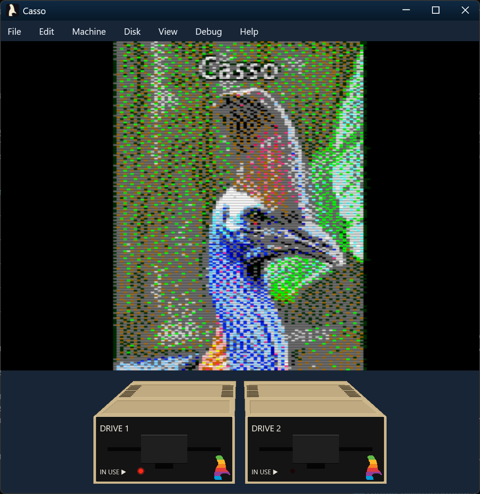
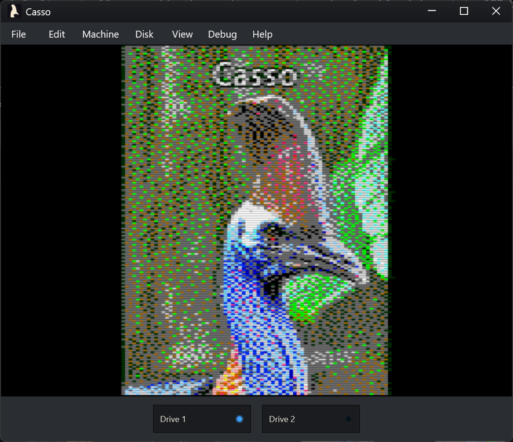
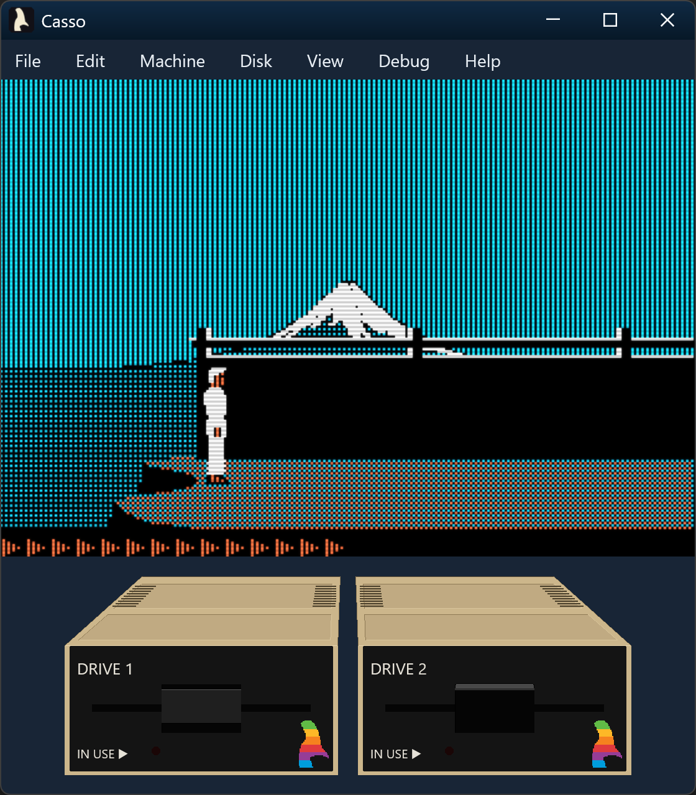
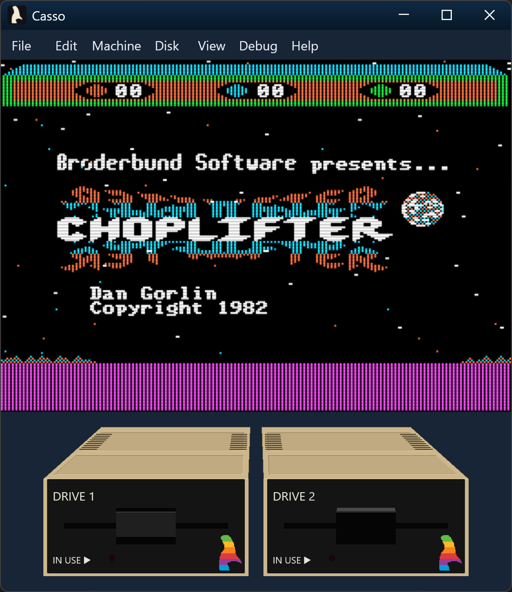
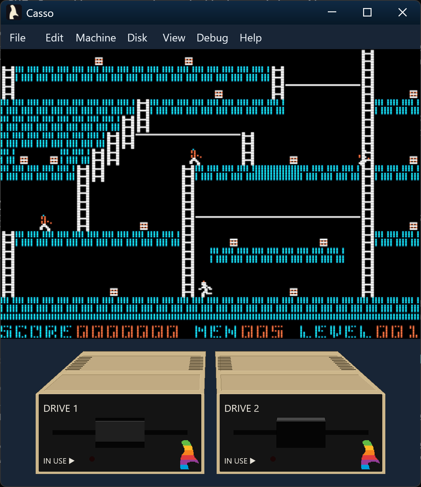
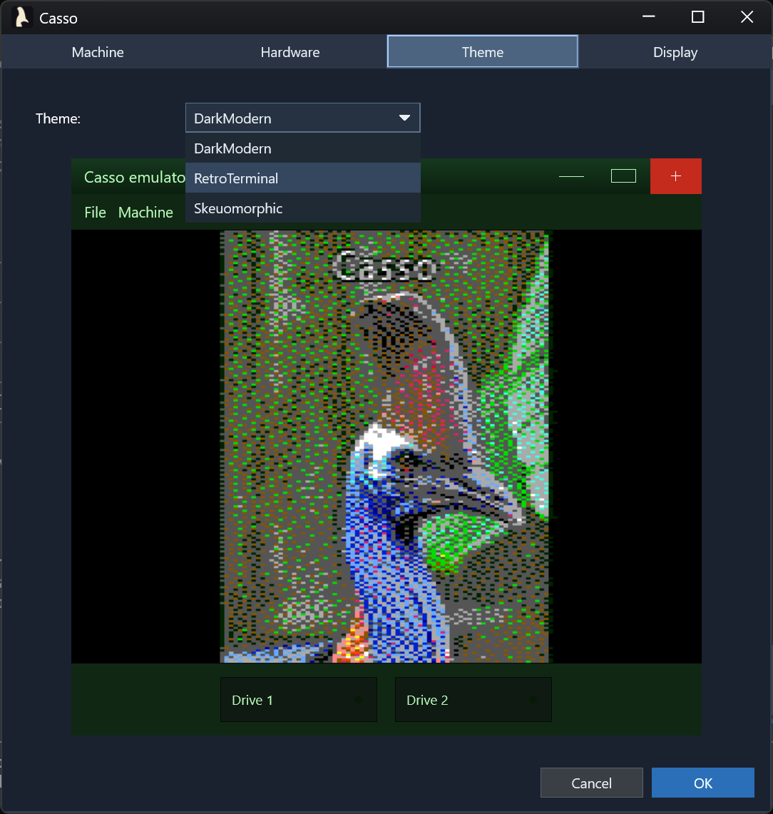
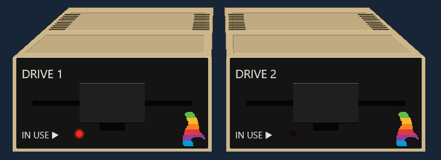
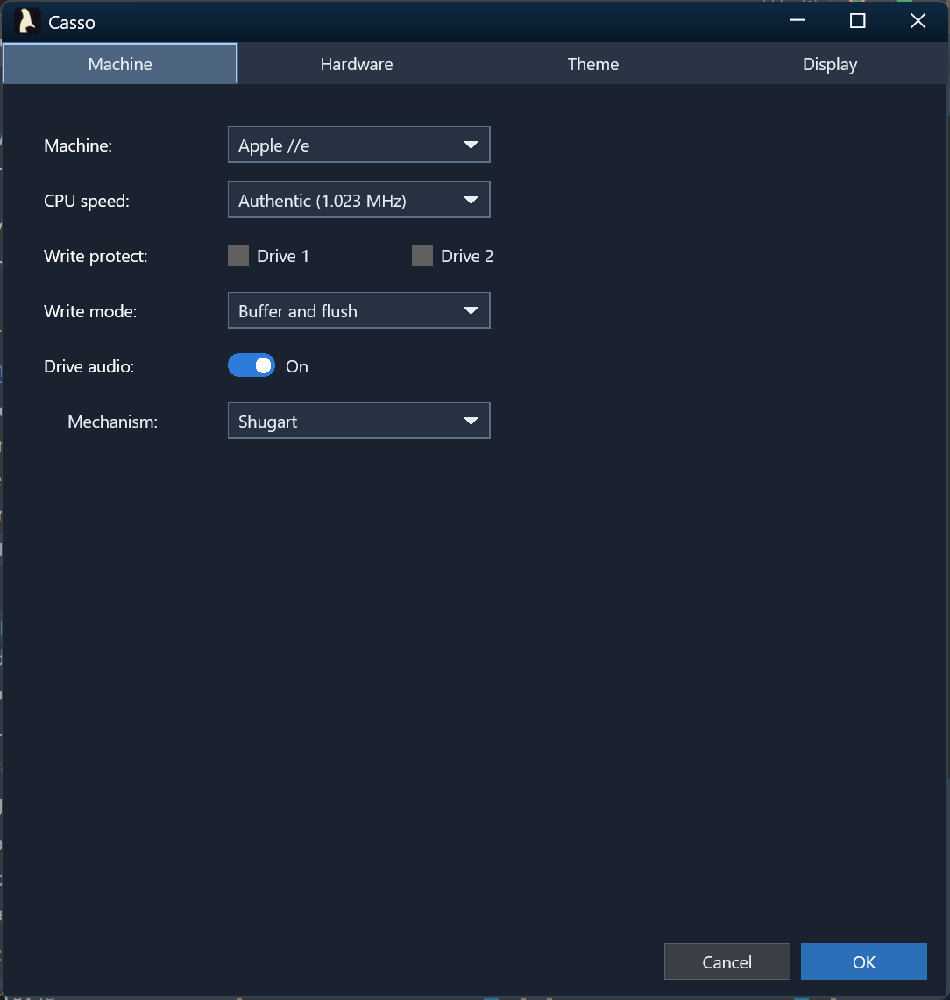
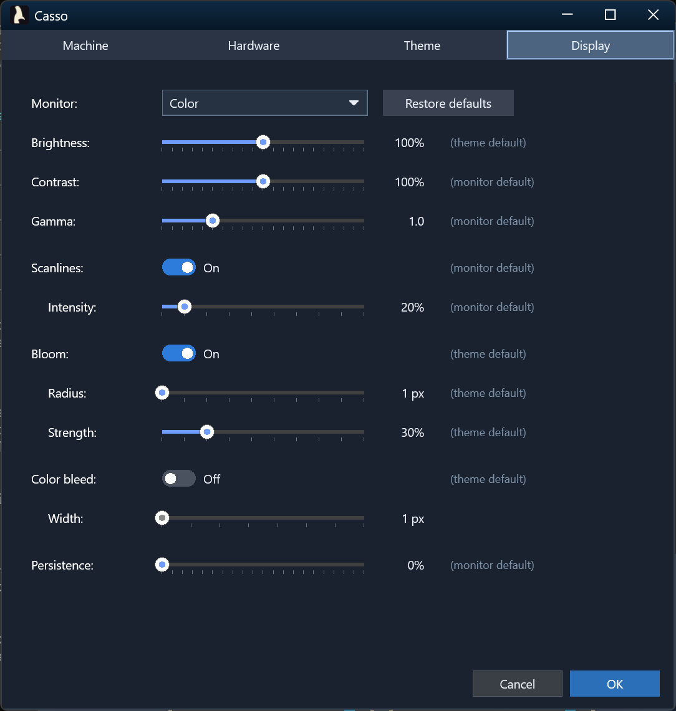
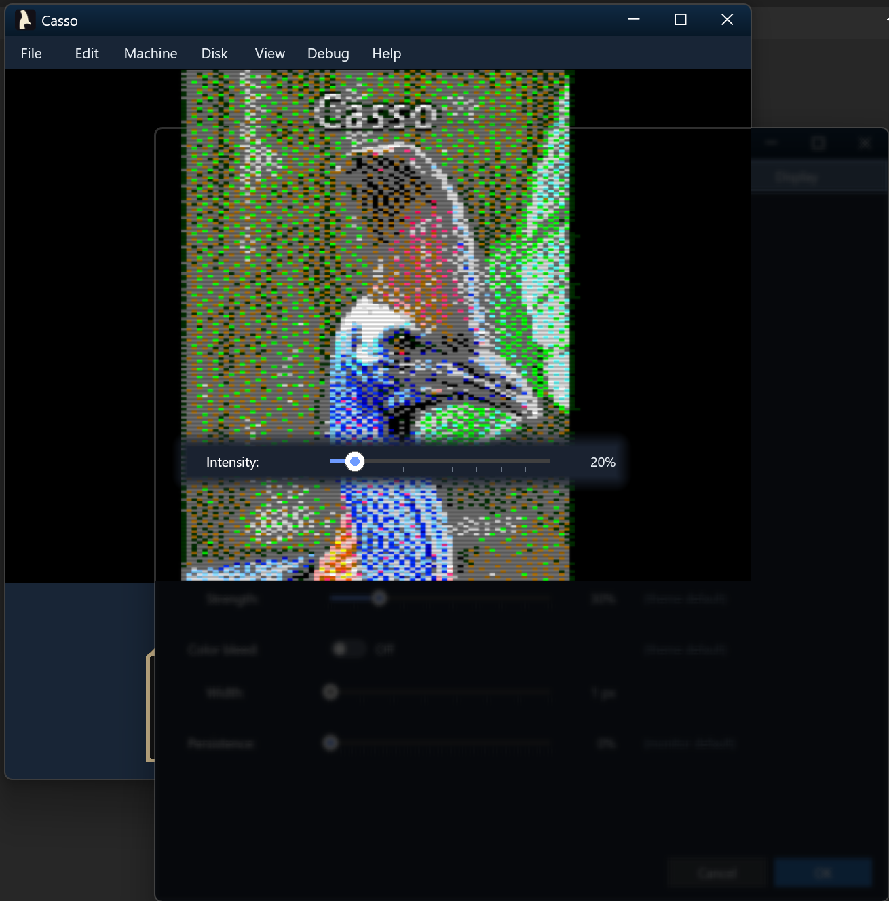

# Casso

[](https://github.com/relmer/Casso/actions/workflows/ci.yml)
[](LICENSE)
<!--
[](https://github.com/relmer/Casso/releases)
-->

## About

Casso is a retro / classic-machine platform emulator and from-scratch AS65-compatible 6502 / 65C02 assembler, written in C++. Today the platform emulator targets the Apple II family (][, ][+, //e, **//c**); the abstractions are generic enough to host other 6502-based machines later.

Two of the three built-in themes booting the [casso-rocks demo disk](Apple2/Demos) — same Apple //e core, different chrome:

<table align="center" width="100%"><tr>
  <td valign="top" width="50%"></td>
  <td valign="top" width="50%"></td>
</tr></table>

The project includes:

- **Apple II platform emulator** — GUI-based Apple II, II+, //e, //e Enhanced, and //c emulator with D3D11 rendering, WASAPI audio, Disk II controller with realistic mechanical sounds, Mockingboard sound card (dual 6522 VIA + AY-3-8910 PSG), analog game I/O (joystick/paddle via the PREAD timer), data-driven machine configs, 80-column text + Double Hi-Res, auxiliary RAM, audit-correct Language Card state machine, and cycle-accurate IRQ/NMI infrastructure.
- **6502 CPU emulator** — passes [Klaus Dormann's functional test suite](https://github.com/Klaus2m5/6502_65C02_functional_tests) and all 151 legal-opcode sets from [Tom Harte's SingleStepTests](https://github.com/SingleStepTests/ProcessorTests) (10,000 vectors each).
- **AS65-compatible assembler** — a from-scratch reimplementation of Frank A. Kingswood's AS65, intended as a drop-in replacement. Supports the complete AS65 syntax: macros, conditional assembly (`if`/`ifdef`/`ifndef`/`else`/`endif`), the full expression evaluator (arithmetic, bitwise, logical, shift, `<`/`>` byte selectors, current-PC `*`), `equ`/`=` constants, `include`, three-segment model (`code`/`data`/`bss`), AS65-style listing output, and AS65 command-line flags (`-l`, `-t`, `-s`, `-s2`, `-z`, `-c`, `-w`, `-d`, `-g`, ...) including flag concatenation (`-tlfile`).
- **CLI tool** — runs as an AS65-style assembler by default, or with the `run` subcommand to load and execute a binary or assembly source.
- **First-run asset bootstrap** — Casso fetches the ROMs, sample disks, and Disk II audio samples it needs on first launch (with user consent), so a fresh `Casso.exe` boots to a usable //e BASIC prompt with no manual setup.
- **Headless test harness** — `HeadlessHost` drives the emulator with no Win32 window, enabling deterministic integration tests for cold boot, disk boot, video framebuffer hashing, and reset semantics.
- **2000+ unit tests** — comprehensive coverage of CPU instruction encoding, addressing modes, arithmetic, branching, assembler features, audio pipeline (speaker + drive + Mockingboard), 6522 VIA timers/IRQ + AY-3-8910 synthesis, //e MMU + Language Card, video timing, Disk II nibble engine, WOZ + nibblized image formats, 80-col + DHGR video, reset semantics, perf budget, and backwards-compat for ][ and ][ plus machines.

## What's New

See [CHANGELOG.md](CHANGELOG.md) for the granular history.

### Apple //c + //e Enhanced (v1.8.0)

Casso now emulates the **Apple //c** (ROM 4, 5.25"/128K): a Rockwell
R65C02 core validated against the Dormann and Harte conformance suites,
the slotless phantom-slot firmware map with the 32K bank-switched ROM,
the built-in IWM disk drive (plus a connectable external drive), dual
6551 serial ports, and the //c mouse — a full IOU hardware model driven
by the machine's real mouse firmware, with the host pointer mapping
non-capturing onto the guest. Input mapping split into independent
Keys (arrows→joystick) and Pointer (paddle/mouse) selections with a new
segmented device selector drawing the real Apple peripherals. The two
latching switches on the //c case are modeled too, on a skeuomorphic
control strip in the ImageWriter-platinum case colour: the **80/40**
switch drives `$C060` (in = 80-column startup, read by a booting disk's
`PR#3`), the **keyboard** switch flips the typed stream to Dvorak, and a
**reset** button reproduces Control-Reset (inert without Ctrl), alongside
disk-use / power indicator LEDs. The same 65C02 also powers a new **Apple
//e Enhanced** profile (issue #86) — the //e with the enhanced firmware +
MouseText video ROM, for the CMOS titles that misbehave on the NMOS //e.

### Mockingboard sound card (v1.7.0)

Casso now emulates the Sweet Micro Systems Mockingboard A/C — the de-facto
Apple II audio standard. Two clean-room chip cores written from the datasheets
(a reusable **6522 VIA** and the **AY-3-8910 PSG**: 3 tone voices + noise +
envelope) render to stereo float PCM, with VIA Timer 1 driving the periodic
IRQs music players use for tempo. The card ships in slot 4 of the ][+ and //e
profiles; it is installed or removed from its slot in the Hardware tab's
device list. Games like *Ultima IV*, *Skyfox*, and *Music
Construction Set* get their real soundtracks back.

### Reliable disk writes (v1.6.2–v1.6.3)

Fixed several bugs that corrupted or silently dropped guest writes to `.dsk`,
`.do`, `.po`, and `.woz` images — a Logic State Sequencer write-bit error that
garbled DOS 3.3 `SAVE`s (GH #89), and missing WOZ write-back that discarded
every `.woz` edit. Dirty disks now also flush automatically when the drive
motor spins down, so changes survive a crash or force-quit.

### Disk picker, settings, and a reusable UI library (v1.6.0)

The boot / Insert-Disk picker gained a search box and click-to-sort columns,
and — when Casso runs from a source checkout — it's preloaded with the disk
images in the repo's `Apple2/Demos/` folder as one-click mounts. The list
scrolls horizontally and the dialog resizes cleanly.

Settings picked up an "Apply now" button to try a theme without closing the
dialog, a "restart required" notice with an "OK (reboot)" button when a
change needs a power-cycle, and support for a machine with no Disk ][
controller — the Disk tab, the drive band, and boot all adjust when there
isn't one.

Under the hood, Casso's window chrome was pulled out into a standalone,
reusable **Dxui** library (Direct2D / DirectWrite) that other projects can
build on, with the window host owning the Direct3D swap chain directly.

### Game-input revamp (v1.5.1523)

Real-time action games like *Karateka*, *Choplifter*, and *Lode Runner*
are now playable from the host keyboard without a physical joystick.
A new **Map Arrows to Joystick** mode maps the arrow keys to paddle 0/1
(last-pressed-wins on opposing keys) and binds **X** / **Z** to buttons
0/1 (the same Open-Apple / Closed-Apple soft-switches the host Alt keys
drive, so both input sources coexist); in this mode, those keys are not
sent as standard input via the //e keyboard so they don't also type. The
//e keyboard itself now generates hardware-faithful
auto-repeat (initial delay, then steady cadence) instead of leaning on
host-OS key repeat, so timing-sensitive arrow input in games behaves
the way it did on real hardware.

Three ways to toggle joystick mode — the Machine menu, a new **Ctrl+Shift+J**
accelerator, and a dedicated **Joystick Mode** toggle button in the
bottom drive bar (frameless press-to-pin button with a blue glowing
LED, hover tooltip, and focus ring). A new Input Debug panel
(**Ctrl+Shift+I**) logs the host → //e key events, the `$C000`/`$C010`
strobe, Open/Closed-Apple state, and synthesized joystick/paddle reads
(`$C064`–`$C067` PREAD, `$C070` PTRIG) with per-lane filter checkboxes,
column sorting, pause, and a Copy-to-clipboard button.

Press **F10** to drive the painted chrome with the keyboard: a Tab
focus ring walks across menu titles, the Joystick Mode button, and the
drive widgets, with Enter/Space to activate and Esc to return to the
//e. The ring never leaks keystrokes through to the emulated keyboard,
so navigating chrome can't drop stray letters into a //e prompt.

### Themed startup experience (v1.5.1395)

The first-run asset bootstrap — ROMs, sample disks, and Disk II audio samples — now downloads through a single themed progress dialog that fetches every asset concurrently rather than serial-prompting through three separate Win32 dialogs. The boot-disk MRU picker that appears when no disk is configured also paints through the same DirectWrite pipeline as the rest of the chrome, so the entire first-launch path honours the active theme (Skeuomorphic / Dark Modern / Retro Terminal) instead of dropping back to native gray.

### Copy-protected games boot (v1.5.1289)

Casso's Disk II stack now models quarter-track head positioning and the authentic Logic State Sequencer faithfully enough to boot original, copy-protected Broderbund WOZ disk images straight off the wire. Classics like *Karateka*, *Choplifter*, and *Lode Runner* load and run from their unmodified preservation images, protection schemes and all.

| Karateka | Choplifter | Lode Runner |
| :---: | :---: | :---: |
|  |  |  |

### UI Overhaul (v1.4.1171)

Casso's entire chrome moved from the legacy Win32 menu bar / Win32 dialogs to a borderless, themed shell rendered straight onto the same D3D11 framebuffer that draws the emulator video — using a native Direct2D / DirectWrite pipeline (`DxUiPainter` + `DwriteTextRenderer`), no third-party UI engine.

**Three built-in themes** — Skeuomorphic, Dark Modern, Retro Terminal — hot-swappable from **Settings → Theme** with no restart and no machine reset. Each theme ships under `Resources/Themes/<Name>/` (extracted to `Themes/<Name>/` at first run) with a `theme.json` describing colors, CRT defaults, drive visual profile, and other UI tokens consumed by the native widget renderer. The token-based custom-theme authoring surface is still being wired through the native widgets — see [docs/themes/AUTHORING.md](docs/themes/AUTHORING.md) for the current state.

<p align="center"></p>

**Skeuomorphic drive widgets** with realistic Apple Disk II faceplates: perspective-projected case top with two indented lid panels that taper toward the back, nine vent slits down each side, beige case wrapping a black inset faceplate on all four sides, cantilever door hinged at the slot top that tilts up and back (tucking inside the case with a small flap visible when fully open) revealing a recessed finger-pull behind it, status LED, and the Cassowary rainbow logo. Click a drive to pick a disk image, or drag-and-drop a `.dsk` / `.do` / `.po` / `.nib` file onto it. Eject animates the door open even on an empty drive.

<p align="center"></p>

**Consolidated Settings panel** replaces the old `OptionsDialog` and `MachinePickerDialog`. Machine selection, machine info, emulation speed, video color mode, disk write mode, floppy sound + mechanism (with per-sound Motor / Head / Door volume, per-drive stereo pan, and play-button audition), write-protect, theme picker, and the new CRT controls live in one non-modal in-window panel with full keyboard navigation.

<p align="center"></p>

**CRT effects** — scanlines, phosphor bloom, and color bleed (each independently toggleable, with its own parameter sliders), plus persistence trails, contrast, and gamma sliders. Per-monitor presets (Color / Green / Amber / White) seed sensible defaults; themes can override; user tweaks persist as overrides on top of either. The Settings popup gets out of your way as you scrub a control — the panel fades, the emulator behind it stays sharp inside a per-pixel clip, and only the focused control remains opaque — so you can evaluate the effect of every parameter change live.

<p align="center"></p>

<p align="center"></p>

**Unified user preferences** persist in `%LOCALAPPDATA%\Casso\UserPrefs.json`: global UI state under `global`, and per-machine deltas under `machines` keyed by display name. Most settings live there today; a small set of legacy values (last-loaded machine, per-machine last-inserted disk paths, audio download consent, window placement) still live in the registry for backwards compatibility and will migrate to JSON in a follow-up.

### Disk II audio (v1.3.696)

Realistic mechanical sounds during disk activity, mixed into the WASAPI pipeline alongside the //e speaker:

- Stereo motor hum, head-step clicks, track-0 / max-track bumps, and disk insert / eject sounds.
- Per-drive equal-power stereo panning: single-drive profiles play centered; in two-drive profiles Drive 1 leans left, Drive 2 leans right.
- Step-vs-seek discrimination: contiguous step bursts during DOS RWTS recalibration fuse into a continuous seek buzz instead of N overlapping clicks.
- *View → Options...* dialog with a Drive Audio toggle (default on) and a Disk II mechanism dropdown (Shugart SA400 by default, or Alps 2124A). Both persist per-machine via the registry.
- First-run consent dialog downloads the actual recordings from the [OpenEmulator](https://github.com/openemulator/libemulation) project; OGGs are decoded in memory via vendored `stb_vorbis` and written as WAV (no `.ogg` retained on disk). Asked once per machine, persisted thereafter.
- Generic `IDriveAudioSink` / `IDriveAudioSource` / `DriveAudioMixer` abstraction so future drive types (//c internal 5.25, DuoDisk, Apple 5.25 Drive, ProFile, ...) plug in without touching the mixer.

## Project Structure

```
Casso.sln
├── CassoCore/     Static library — CPU emulator, assembler, parser, opcode table
├── CassoEmuCore/  Static library — Apple II devices, video modes, audio generator + drive-audio mixer
├── Dxui/          Static library — reusable Direct2D/DirectWrite UI framework (host window, panels, layouts, widgets, menu bar, popup host, dialogs)
├── Casso/         Win32 application — Apple II platform emulator (D3D11, WASAPI, Disk II audio)
├── CassoCli/      Console application — AS65-compatible assembler CLI with `run` subcommand
└── UnitTest/      Test DLL — Microsoft Native CppUnitTest (1900+ tests)
```

## Requirements

- Windows 10/11
- PowerShell 7 (`pwsh`) for build/test scripts
- Visual Studio 2026 (v18.x)
  - Workload: **Desktop development with C++**
  - Components: MSVC build tools, Windows SDK, C++ unit test framework
  - Optional: MSVC ARM64 build tools (for ARM64 builds)
- Optional: VS Code (repo includes `.vscode/` tasks)

## Quick Start

### Build

```powershell
# Build Debug for current architecture (Ctrl+Shift+B in VS Code)
.\scripts\Build.ps1

# Build Release
.\scripts\Build.ps1 -Configuration Release

# Build all platforms
.\scripts\Build.ps1 -Target BuildAllRelease

# Rebuild with code analysis (warnings as errors)
.\scripts\Build.ps1 -Configuration Release -RunCodeAnalysis
```

### Test

```powershell
# Build and run tests
.\scripts\RunTests.ps1

# Or use VS Code: Run Tests (current arch)
```

### Assemble and Run

```powershell
# Assemble a source file to a flat binary (AS65 mode — no subcommand)
CassoCli input.a65 -o output.bin

# Assemble with a listing file and a symbol table
CassoCli input.a65 -o output.bin -l listing.txt -t

# Output Motorola S-record (.s19) or Intel HEX (.hex)
CassoCli input.a65 -s   -o output.s19
CassoCli input.a65 -s2  -o output.hex

# Pre-define a symbol on the command line
CassoCli input.a65 -d DEBUG=1 -o output.bin

# Generate a listing with cycle counts
CassoCli input.a65 -c -l listing.txt

# Assemble 65C02 source (CMOS opcodes: STZ, BRA, RMB/SMB/BBR/BBS, ...)
# The default is a strict 6502; 65C02-only opcodes are rejected without --cpu.
CassoCli input.a65c --cpu 65c02 -o output.bin

# Assemble and run an assembly source directly
CassoCli run input.a65

# Load and run a pre-assembled binary at a specific address
CassoCli run output.bin --load $8000
```

### Apple II Emulator

The emulator requires Apple II ROM images, which are copyrighted by Apple and not
distributed with this project. A script is included to download them from the
[AppleWin](https://github.com/AppleWin/AppleWin) project:

```powershell
# Download ROM images into the per-machine Machines/<Name>/ folders
.\scripts\FetchRoms.ps1

# Run the emulator (defaults to Apple II+)
Casso

# Run with a specific machine config
Casso --machine Apple2e
```

ROM images live under `Machines/<MachineName>/` (e.g.,
`Machines/Apple2e/Apple2e.rom`) and shared device boot ROMs live
under `Devices/<Family>/` (e.g., `Devices/DiskII/Disk2.rom`). Both
`Machines/` and `Devices/` are fully runtime-managed: every file
inside is either extracted from binary-embedded resources or
downloaded on first launch (with user consent). Delete either
directory and the next launch rebuilds it from scratch.

Available machine configs are in `Machines/<MachineName>/<MachineName>.json`.

## Assembler Features

| Feature | Syntax / Flag |
|---------|---------------|
| All 56 mnemonics | `LDA`, `STA`, `ADC`, `BNE`, etc. |
| All addressing modes | `#$42`, `$30`, `$1234,X`, `($20),Y`, `A` |
| CPU target | `--cpu 6502` (default, strict) or `--cpu 65c02` for CMOS opcodes (`STZ`, `BRA`, `TSB`/`TRB`, `RMB`/`SMB`/`BBR`/`BBS`, `(zp)`, `(abs,X)`); Rockwell bit ops take `<bit>,<zp>[,<target>]` or the suffixed `RMB0`/`BBR3` form |
| Labels | `loop: DEX` / `BNE loop` |
| Directives | `.org $8000`, `.byte $FF`, `.word $1234`, `.text "hello"`, `code`/`data`/`bss` |
| Constants | `value = $42`, `carry equ %00000001` (chains and forward refs supported) |
| Conditionals | `if`/`ifdef`/`ifndef`/`else`/`endif` |
| Macros | `name macro` … `endm`, with arguments and `\` line continuation |
| Includes | `include "file.a65"` |
| Comments | `; full line` / `LDA #$42 ; inline` |
| Number formats | `$FF` (hex), `%10101010` (binary), `255` (decimal) |
| Expressions | full operator set: `+ - * / % & \| ^ ~ << >>`, `<label`, `>label`, current-PC `*` |
| Listing output | `-l [file]` (stdout or file), `-c` for cycle counts, `-m` for macro expansion |
| Symbol table | `-t` |
| Output formats | flat binary (default), `-s` (S-record), `-s2` (Intel HEX) |
| Fill control | `-z` for `$00` fill (default `$FF`) |
| Pre-defined symbols | `-d NAME` or `-d NAME=VALUE` |
| Debug info | `-g [file]` |
| Warning control | `--warn`, `--no-warn`, `--fatal-warnings` |
| Verbose / quiet | `-v` / `-q` |
| Flag concatenation | `-tlfile` ≡ `-t -l file` (AS65 style) |

## CPU Emulation Status

All 56 standard 6502 mnemonics are implemented. Validated against [Klaus Dormann's functional test suite](https://github.com/Klaus2m5/6502_65C02_functional_tests) (full pass) and [Tom Harte's SingleStepTests](https://github.com/SingleStepTests/ProcessorTests) (all 151 legal-opcode test sets, 10,000 vectors each).

## Roadmap

### Done

- [x] Pass [Klaus Dormann's 6502 functional test suite](https://github.com/Klaus2m5/6502_65C02_functional_tests) ([#7](https://github.com/relmer/Casso/issues/7))
- [x] Per-opcode validation against [Tom Harte's SingleStepTests](https://github.com/SingleStepTests/ProcessorTests) ([#29](https://github.com/relmer/Casso/issues/29), [#38](https://github.com/relmer/Casso/issues/38))
- [x] Apple //e fidelity — cold boot to BASIC, audit-correct Language Card, 64 KB aux RAM, 80-column text + Double Hi-Res, soft reset vs. power cycle, IRQ/NMI dispatch, RDVBLBAR
- [x] Disk II controller — DOS 3.3 / ProDOS `.dsk` / `.do` / `.po` nibblization + WOZ v1 / v2 with auto-flush on eject
- [x] Disk II mechanical audio — stereo motor hum, head-step clicks, track-0 bump, disk insert / eject sounds, with a runtime Settings → Machine → Drive audio toggle. Built on a generic `IDriveAudioSink` / `IDriveAudioSource` / `DriveAudioMixer` abstraction so future drive types (//c internal 5.25, DuoDisk, ProFile, …) plug in without touching the mixer
- [x] Mockingboard A/C sound card — clean-room 6522 VIA + AY-3-8910 PSG (3 tone voices + noise + envelope), stereo PCM, Timer 1 tempo IRQs, slot-4 install on ][+ / //e ([#66](https://github.com/relmer/Casso/issues/66))
- [x] Headless test harness for deterministic integration tests (`HeadlessHost`, framebuffer scraper, keyboard injector)
- [x] Performance gate — emulator throughput budget enforced in CI (Release-only)
- [x] Cycle-accurate execution and profiling ([#57](https://github.com/relmer/Casso/issues/57))
- [x] Disk II copy-protection fidelity — motor spin-up delay, MC3470 weak-bit emulation, real 16-state LSS, quarter-track read pipeline, and bit-level write path ([#67](https://github.com/relmer/Casso/issues/67))
- [x] Boot *Karateka* from its WOZ image (RWTS18 copy protection) ([#68](https://github.com/relmer/Casso/issues/68))
- [x] Boot *Lode Runner* from its WOZ image (copy protection) ([#70](https://github.com/relmer/Casso/issues/70))
- [x] Play *Space Quarks* on the Apple ][ and ][ plus — required Apple ][ and ][ plus game-port emulation (paddles, buttons, PTRIG) plus an inverse-text character-ROM fix
- [x] 65C02 extended instruction support (Rockwell R65C02 core), with assembler `--cpu 65c02` flag ([#9](https://github.com/relmer/Casso/issues/9))

### Medium Priority

- [ ] Undocumented / illegal opcode support ([#52](https://github.com/relmer/Casso/issues/52))
- [ ] Rockwell / WDC 65C02 variants ([#49](https://github.com/relmer/Casso/issues/49), [#50](https://github.com/relmer/Casso/issues/50))
- [ ] *Choplifter* gameplay starts after the title screen (WOZ copy protection) ([#69](https://github.com/relmer/Casso/issues/69), [#72](https://github.com/relmer/Casso/issues/72))

### Low Priority

- [ ] NES 6502 / Ricoh 2A03 variant ([#47](https://github.com/relmer/Casso/issues/47))
- [ ] Example programs — ready-to-assemble demos and tutorials ([#55](https://github.com/relmer/Casso/issues/55))
- [ ] VS Code extension — syntax highlighting, assemble-on-save, inline diagnostics ([#54](https://github.com/relmer/Casso/issues/54))
- [ ] Interactive debugger / monitor — step, breakpoints, register watch, memory dump ([#51](https://github.com/relmer/Casso/issues/51))
- [ ] Relocatable object output — o65 format for cc65 toolchain integration ([#58](https://github.com/relmer/Casso/issues/58))

## Why "Casso"?

While [emu](https://en.wikipedia.org/wiki/Emu) is the more obvious name and mascot for an emulator, I wanted Casso to stand out; to be just a little weird; to _think different_. I picked its larger, flightless, considerably more dangerous cousin: the [cassowary](https://en.wikipedia.org/wiki/Cassowary)—Casso to his friends.

I thus present to you our regal namesake—revel in his splendor!

<p align="center">
  
</p>

*Cassowary photo by [Mr. Smiley / BunyipCo](https://bunyipco.blogspot.com/2015/04/cassowary-update.html), licensed under [CC BY-NC-SA 3.0](https://creativecommons.org/licenses/by-nc-sa/3.0/).*

## Acknowledgments

Casso's correctness is validated against two exceptional open-source test suites:

- **[Klaus Dormann's 6502 Functional Test Suite](https://github.com/Klaus2m5/6502_65C02_functional_tests)** — [@Klaus2m5](https://github.com/Klaus2m5)'s exhaustive functional test exercises every documented 6502 behavior: all instructions, addressing modes, flag interactions, BCD arithmetic, and edge cases. Casso passes the full suite.
- **[Tom Harte's SingleStepTests](https://github.com/SingleStepTests/ProcessorTests)** — [@TomHarte](https://github.com/TomHarte)'s per-opcode test vectors validate every legal 6502 opcode against cycle-accurate reference traces. Casso passes all 151 legal-opcode test sets (10,000 vectors each).

Thank you to both authors for making these invaluable resources freely available. They are the gold standard for 6502 emulator validation.

## Contributing

See [CONTRIBUTING.md](CONTRIBUTING.md) for commit conventions, build instructions, code style guidelines, and other contributor guidelines.

## License

[MIT](LICENSE)
