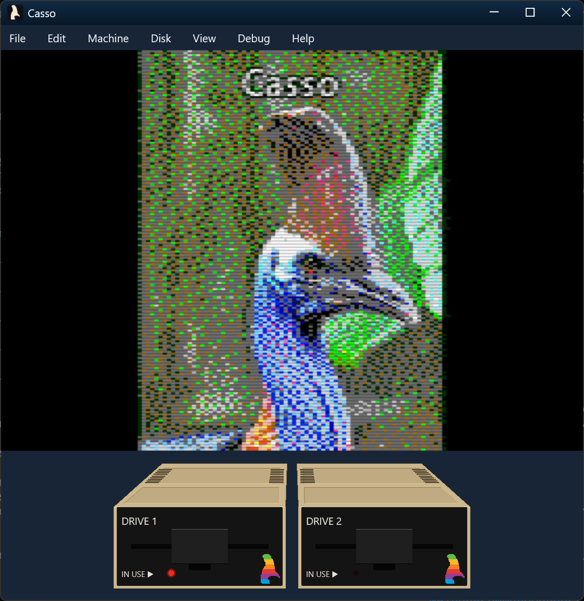
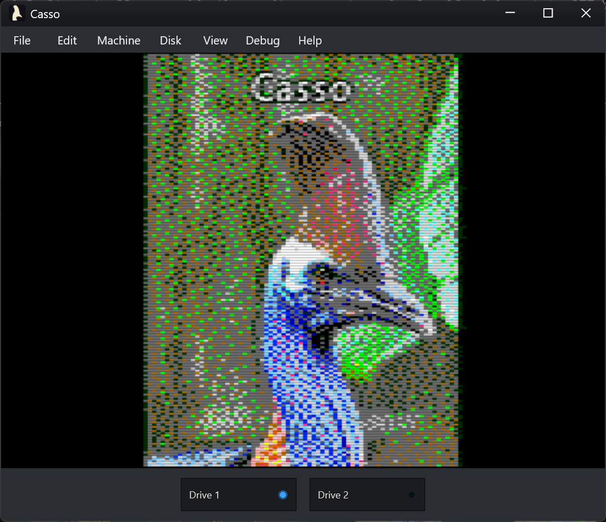
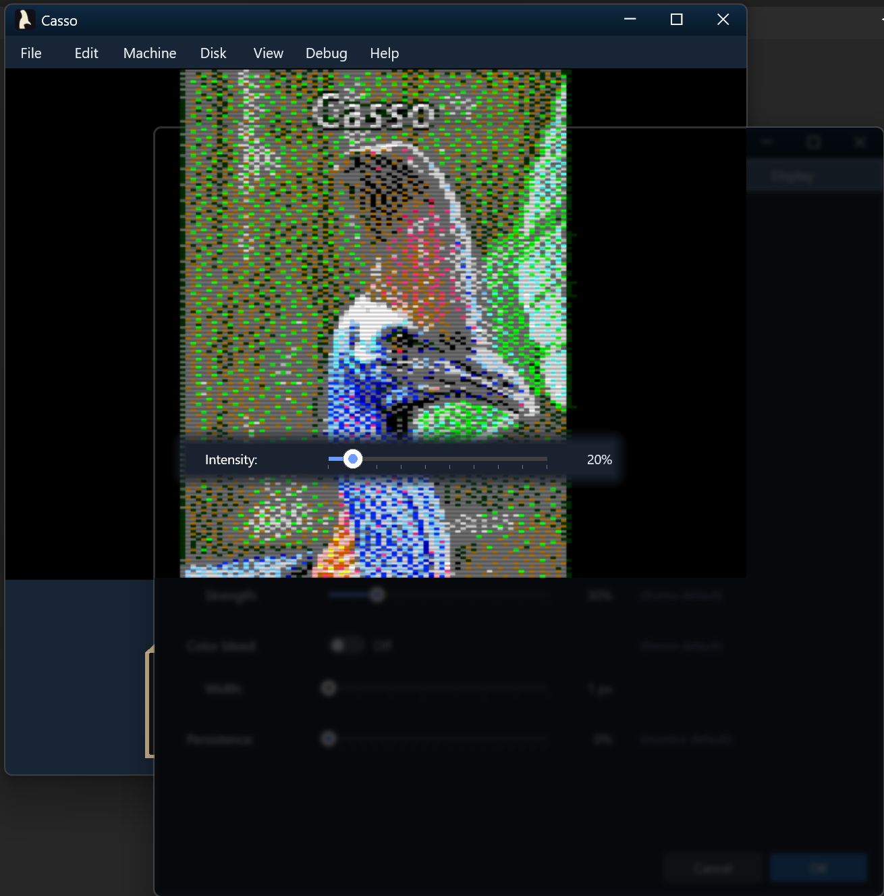

# Casso

[](https://github.com/relmer/Casso/actions/workflows/ci.yml)
[](LICENSE)
<!--
[](https://github.com/relmer/Casso/releases)
-->

## About

Casso is a retro / classic-machine platform emulator and from-scratch AS65-compatible 6502 / 65C02 assembler, written in C++. Today the platform emulator targets the Apple II family (][, ][+, //e, **//c**); the abstractions are generic enough to host other 6502-based machines later.

Two of the three built-in themes booting the [casso-rocks demo disk](Apple2/Demos) — same Apple //e core, different chrome:

<table align="center" width="100%"><tr>
  <td valign="top" width="50%"></td>
  <td valign="top" width="50%"></td>
</tr></table>

The project includes:

- **Apple II platform emulator** — GUI-based Apple II, II+, //e, //e Enhanced, and //c emulator with D3D11 rendering, WASAPI audio, Disk II controller with realistic mechanical sounds, in-app blank-disk creation (DOS 3.3 / ProDOS / raw across WOZ / DSK / PO, optionally bootable) with per-disk write protection, Mockingboard sound card (dual 6522 VIA + AY-3-8910 PSG), an emulated ImageWriter II printer (parallel card, real-3D live preview with mechanical audio, PNG / clipboard / Windows-print delivery with print preview), analog game I/O (joystick/paddle via the PREAD timer), data-driven machine configs, 80-column text + Double Hi-Res, auxiliary RAM, audit-correct Language Card state machine, and cycle-accurate IRQ/NMI infrastructure.
- **6502 CPU emulator** — passes [Klaus Dormann's functional test suite](https://github.com/Klaus2m5/6502_65C02_functional_tests) and [Tom Harte's SingleStepTests](https://github.com/SingleStepTests/ProcessorTests) for all 151 legal opcodes plus the stable undocumented NMOS opcodes (SAX, LAX, DCP, ISC, SLO, RLA, SRE, RRA and the NOP family). The Harte vectors are recorded from real hardware, so they are an independent oracle rather than a restatement of our own assumptions. 200 vectors per opcode are checked in and run on every build; the full 10,000 per opcode are a download away and are what you run when touching the CPU core — see [docs/testing.md](docs/testing.md).
- **AS65-compatible assembler** — a from-scratch reimplementation of Frank A. Kingswood's AS65, intended as a drop-in replacement. Supports the complete AS65 syntax: macros, conditional assembly (`if`/`ifdef`/`ifndef`/`else`/`endif`), the full expression evaluator (arithmetic, bitwise, logical, shift, `<`/`>` byte selectors, current-PC `*`), `equ`/`=` constants, `include`, three-segment model (`code`/`data`/`bss`), AS65-style listing output, and AS65 command-line flags (`-l`, `-t`, `-s`, `-s2`, `-z`, `-c`, `-w`, `-d`, `-g`, ...) including flag concatenation (`-tlfile`).
- **CLI tool** — runs as an AS65-style assembler by default, with the `run` subcommand to load and execute a binary or assembly source, and with a `disk` subcommand that reads files off an Apple II disk image and puts them back: `disk list`, `get`, `put`, `delete`, and `boot` work on DOS 3.3 and ProDOS volumes in `.dsk`, `.do`, `.po` and `.woz` images alike. That closes the build loop — assemble, place, set the boot program, launch — with one invocation per step and no third-party tool. `CassoCli --help` carries a worked example of the whole loop rather than only a flag list.
- **First-run asset bootstrap** — Casso fetches the ROMs, sample disks, and Disk II audio samples it needs on first launch (with user consent), so a fresh `Casso.exe` boots to a usable //e BASIC prompt with no manual setup.
- **Headless test harness** — `HeadlessHost` drives the emulator with no Win32 window, enabling deterministic integration tests for cold boot, disk boot, video framebuffer hashing, and reset semantics.
- **3300+ unit tests** — comprehensive coverage of CPU instruction encoding, addressing modes, arithmetic, branching, assembler features, audio pipeline (speaker + drive + printer + Mockingboard), 6522 VIA timers/IRQ + AY-3-8910 synthesis, //e MMU + Language Card, video timing, Disk II nibble engine, WOZ + nibblized image formats, DOS 3.3 + ProDOS file read/write and the command path over them, 80-col + DHGR video, the printer pipeline (interpreter, renderer, pagination, pacing, head mechanics + drain engine, preview model, persistence, slot firmware), reset semantics, perf budget, and backwards-compat for ][ and ][ plus machines. Several of them boot a real 6502 over an image the command line just wrote and check what the guest makes of it, because that is the only oracle for "the disk is right" that our own reader cannot satisfy by agreeing with itself.

## Contents

- [About](#about)
- [What's New](#whats-new)
- [Project Structure](#project-structure)
- [Requirements](#requirements)
- [Quick Start](#quick-start)
- [Assembler Features](#assembler-features)
- [CPU Emulation Status](#cpu-emulation-status)
- [Why "Casso"?](#why-casso)
- [Acknowledgments and Attributions](#acknowledgments-and-attributions)
- [Contributing](#contributing)
- [License](#license)

## What's New

See [CHANGELOG.md](CHANGELOG.md) for the granular history, and
[ARCHITECTURE.md](ARCHITECTURE.md) for a technical overview of the emulator's
internals (projects, threading, the memory model, and the optimization log).

### Disk file access from the command line (unreleased)

The build loop no longer leaves the machine. `CassoCli disk` reads files off an
Apple II disk image and puts them back — `list`, `get`, `put`, `delete`, and
`boot` — on DOS 3.3 and ProDOS volumes, in `.dsk`, `.do`, `.po` and `.woz`
images alike, with no third-party tool anywhere in the loop:

```powershell
CassoCli prog.a65 -oprog.bin
CassoCli disk put mydisk.dsk prog.bin --as PROG --type B --addr $6000
CassoCli disk put mydisk.dsk greet.bas --as STARTUP --basic
CassoCli disk boot mydisk.dsk STARTUP
Casso.exe --disk1 mydisk.dsk
```

`CassoCli --help` carries that example, so a newcomer needs nothing but the
tool's own output. `--basic` converts an Applesoft listing to and from the
tokenized form; `--text` converts the high-bit encoding and line endings;
naming neither, the default, moves bytes unchanged, so extract-edit-replace
perturbs nothing the edit did not touch.

**Command-line writes are all-or-nothing.** The complete new image is built and
checked in memory, written beside the target, and put in place atomically, so a
locked file, a write-protected image, a volume with no room, a track that cannot
be re-encoded, or the image changing underneath all leave the original
byte-for-byte as it was, with no temporary left behind.

**That is deliberately not symmetric with the emulator.** A disk edited by a
running guest is written back when the drive flushes, and a flush interrupted
partway carries no such guarantee. Nor does either side detect the other:
`disk put` refuses when some *other* program holds the image open, but a
mounted image is not held open, so a disk mounted in Casso is neither noticed
nor protected. Detecting in-use is out of scope, and the tool says so rather
than implying a clean check means a mounted disk is safe.

### Create blank disks in-app + write-protect toggle (v1.16.0)

<p align="center"></p>

The missing keystone of the write workflow: Casso can now make fresh disks.
The insert-disk picker's pinned **`<Create new disk...>`** row opens a themed
save-style dialog — browse folders right in the dialog, pick the format
(**DOS 3.3**, **ProDOS 1.1.1**, or unformatted raw media) and the image type
(**WOZ**, **DSK**, or **PO**; only legal pairings are offered), name the file,
and the new disk mounts straight into the drive that opened the picker. A
created disk is immediately usable — `SAVE` and `CATALOG` work with no `INIT`
step, exactly like a disk a period formatter produced — and a **Make bootable**
checkbox installs the real OS from the stock master disks (downloaded on
demand): DOS 3.3 disks boot to a clean Applesoft prompt, ProDOS disks boot
through `PRODOS` into BASIC.SYSTEM. The dialog refuses targets currently
mounted in a drive, confirms overwrites and drive replacement, and reopens in
the folder you last created in.

Alongside it, a **write-protect toggle** for mounted disks: the Disk menu
names its target — "Write-protect *"Blank Disk.woz"*" flips to "Allow writes
to *"Blank Disk.woz"*" once protected. WOZ images carry the flag inside the
file (it travels with the image); sector formats use the host file's
read-only attribute. The drive widget's brass padlock and a cause-specific
tooltip ("WOZ write-protect flag", "file is read-only", "no write
permission") track every change, and a protected disk fails a guest `SAVE`
with `WRITE PROTECTED`, just like the notch tab on real media.

### Apple //c mouse: MousePaint works again (v1.15.0)

Fixed a //c mouse-interrupt bug that made **MousePaint**'s main app unusable —
menus and tools ignored every click and the cursor lagged. The //c only
partially decodes its paddle-timer strobe, so *any* `$C070`–`$C07F` access
clears the VBL interrupt; Casso recognized only the literal `$C070`. Mouse apps
that acknowledge the VBL via a `$C07x` write (MousePaint writes `$C079` each
interrupt) therefore never cleared it, and the resulting interrupt storm starved
the app of CPU. Also trimmed the per-instruction //c mouse tick cost (~31%).

### Emulated ImageWriter II printer (v1.14.0)

<p align="center"></p>

Casso now emulates a full **Apple ImageWriter II** dot-matrix printer, end to
end — a parallel printer card sits in slot 1 (default on ][, ][+, //e, and //e
Enhanced) and the guest can print for real. `PR#1` lists a BASIC program or
`CATALOG`s a disk in an original 95-glyph dot-matrix font; The Print Shop prints
its banners, signs, and greeting cards in full four-color glory, its command set
locked from real Print Shop byte captures (ESC-G / ESC-L bit image, seven-color
ribbon with overprint composites, and the documented pitch and line-spacing
family).

Print output appears in a **live skeuomorphic preview** — a real-3D ImageWriter
II (the project's own CAD model) with fanfold paper, tractor-feed holes, and
perforations, feeding out of the platen as you watch. A single print-head clock
drives the whole illusion: the carriage sweeps bidirectionally at true draft
speed laying ink column by column, the paper feeds with the head parked, and the
**mechanical sound** (authentic ImageWriter II recordings by [Scott Lawrence](https://github.com/BleuLlama/ImageWriterIISimulator)) is
gated to what the head is actually doing — a carriage buzz over ink, line-feed
clacks, page feeds, and tear-offs, stereo-panned to the window. A one-page
viewport follows the newest rows; scroll back to review earlier pages and it
snaps to the live row once printing idles.

Any printout delivers three ways without re-printing — **Save** as a PNG, **Copy**
to the clipboard, or **Print** to a real Windows printer (with a paginated print
preview) — and the paper stays loaded until you tear it off, so a pending
printout even survives across sessions. A command toolbar below the menu bar
carries the printer status LED and a preview button, and **Settings → Printing**
states what printer the current machine emulates and how it connects.

### Emulation and render performance (v1.13.0)

A performance pass across the hot paths that run on every emulated instruction
and every drawn frame. On the CPU side, memory reads serve RAM/ROM inline from
a page table instead of a virtual dispatch, I/O decodes through a direct device
map instead of scanning the device list, the language-card (`$D000–$FFFF`) and
//c internal-ROM (`$C100–$CFFF`) windows are page-mapped, and the interrupt
poll, video-timing tick, and //c mouse tick shed redundant per-instruction
work — so a steady machine idles at noticeably lower CPU, most visibly on the
//c. On the render side, the 40- and 80-column text screens repaint only the
rows that actually changed — a scrolling catalog or a blinking cursor no longer
redraws all 24 rows — the UI chrome caches its shaped text and geometry instead of
re-shaping every label each frame, and the Mockingboard skips synthesis while
fully muted.

### Skeuomorphic CRT monitor (v1.12.0)

An opt-in **CRT monitor desk scene** — a checkbox on **Settings → Theme**
(skeuo themes only, off by default) — frames the emulator display in a
procedurally-drawn period **Apple Monitor //c**: snow-white/platinum shell,
chunky even bezel with straight sides and a slightly bowed glass, a recessed
screen, and the rainbow cassowary brand and a lit power lamp on the chin. The
display sits inside the glass at true 100% zoom, the drives scale to sit in
proportion beneath it, and the whole scene zooms together as the window
resizes. Off by default because the scene trades screen real estate for the
look; toggling it applies live, and off restores the classic bare display.

<p align="center"></p>

### Apple //c case-switch strip (v1.10.0)

The two latching switches on the //c case are modeled on a skeuomorphic
control strip in the //c's platinum case color: the **80/40**
switch drives `$C060` (in = 80-column startup, read by a booting disk's
`PR#3`), the **keyboard** switch flips the typed stream to Dvorak, and a
**reset** button reproduces Control-Reset (inert without Ctrl), alongside
disk-use / power indicator LEDs. Both switch positions persist per machine.

### Apple //c + //e Enhanced (v1.8.0)

Casso now emulates the **Apple //c** (ROM 4, 5.25"/128K): a Rockwell
R65C02 core validated against the Dormann and Harte conformance suites,
the slotless phantom-slot firmware map with the 32K bank-switched ROM,
the built-in IWM disk drive (plus a connectable external drive), dual
6551 serial ports, and the //c mouse — a full IOU hardware model driven
by the machine's real mouse firmware, with the host pointer mapping
non-capturing onto the guest. Input mapping split into independent
Keys (arrows→joystick) and Pointer (paddle/mouse) selections with a new
segmented device selector drawing the real Apple peripherals. The same
65C02 also powers a new **Apple //e Enhanced** profile (issue #86) — the
//e with the enhanced firmware + MouseText video ROM, for the CMOS titles
that misbehave on the NMOS //e.

### Mockingboard sound card (v1.7.0)

Casso now emulates the Sweet Micro Systems Mockingboard A/C — the de-facto
Apple II audio standard. Two clean-room chip cores written from the datasheets
(a reusable **6522 VIA** and the **AY-3-8910 PSG**: 3 tone voices + noise +
envelope) render to stereo float PCM, with VIA Timer 1 driving the periodic
IRQs music players use for tempo. The card ships in slot 4 of the ][+ and //e
profiles; it is installed or removed from its slot in the Hardware tab's
device list. Games like *Ultima IV*, *Skyfox*, and *Music
Construction Set* get their real soundtracks back.

### Reliable disk writes (v1.6.2–v1.6.3)

Fixed several bugs that corrupted or silently dropped guest writes to `.dsk`,
`.do`, `.po`, and `.woz` images — a Logic State Sequencer write-bit error that
garbled DOS 3.3 `SAVE`s (GH #89), and missing WOZ write-back that discarded
every `.woz` edit. Dirty disks now also flush automatically when the drive
motor spins down, so changes survive a crash or force-quit.

### Disk picker, settings, and a reusable UI library (v1.6.0)

The boot / Insert-Disk picker gained a search box and click-to-sort columns,
and — when Casso runs from a source checkout — it's preloaded with the disk
images in the repo's `Apple2/Demos/` folder as one-click mounts. The list
scrolls horizontally and the dialog resizes cleanly.

Settings picked up an "Apply now" button to try a theme without closing the
dialog, a "restart required" notice with an "OK (reboot)" button when a
change needs a power-cycle, and support for a machine with no Disk ][
controller — the Disk tab, the drive band, and boot all adjust when there
isn't one.

Under the hood, Casso's window chrome was pulled out into a standalone,
reusable **Dxui** library (Direct2D / DirectWrite) that other projects can
build on, with the window host owning the Direct3D swap chain directly.

### Game-input revamp (v1.5.1523)

Real-time action games like *Karateka*, *Choplifter*, and *Lode Runner*
are now playable from the host keyboard without a physical joystick.
A new **Map Arrows to Joystick** mode maps the arrow keys to paddle 0/1
(last-pressed-wins on opposing keys) and binds **X** / **Z** to buttons
0/1 (the same Open-Apple / Closed-Apple soft-switches the host Alt keys
drive, so both input sources coexist); in this mode, those keys are not
sent as standard input via the //e keyboard so they don't also type. The
//e keyboard itself now generates hardware-faithful
auto-repeat (initial delay, then steady cadence) instead of leaning on
host-OS key repeat, so timing-sensitive arrow input in games behaves
the way it did on real hardware.

Three ways to toggle joystick mode — the Machine menu, a new **Ctrl+Shift+J**
accelerator, and a dedicated **Joystick Mode** toggle button in the
bottom drive bar (frameless press-to-pin button with a blue glowing
LED, hover tooltip, and focus ring). A new Input Debug panel
(**Ctrl+Shift+I**) logs the host → //e key events, the `$C000`/`$C010`
strobe, Open/Closed-Apple state, and synthesized joystick/paddle reads
(`$C064`–`$C067` PREAD, `$C070` PTRIG) with per-lane filter checkboxes,
column sorting, pause, and a Copy-to-clipboard button.

Press **F10** to drive the painted chrome with the keyboard: a Tab
focus ring walks across menu titles, the Joystick Mode button, and the
drive widgets, with Enter/Space to activate and Esc to return to the
//e. The ring never leaks keystrokes through to the emulated keyboard,
so navigating chrome can't drop stray letters into a //e prompt.

### Themed startup experience (v1.5.1395)

The first-run asset bootstrap — ROMs, sample disks, and Disk II audio samples — now downloads through a single themed progress dialog that fetches every asset concurrently rather than serial-prompting through three separate Win32 dialogs. The boot-disk MRU picker that appears when no disk is configured also paints through the same DirectWrite pipeline as the rest of the chrome, so the entire first-launch path honors the active theme (Skeuomorphic / Dark Modern / Retro Terminal) instead of dropping back to native gray.

### Copy-protected games boot (v1.5.1289)

Casso's Disk II stack now models quarter-track head positioning and the authentic Logic State Sequencer faithfully enough to boot original, copy-protected Broderbund WOZ disk images straight off the wire. Classics like *Karateka*, *Choplifter*, and *Lode Runner* load and run from their unmodified preservation images, protection schemes and all.

| Karateka | Choplifter | Lode Runner |
| :---: | :---: | :---: |
|  |  |  |

### UI Overhaul (v1.4.1171)

Casso's entire chrome moved from the legacy Win32 menu bar / Win32 dialogs to a borderless, themed shell rendered straight onto the same D3D11 framebuffer that draws the emulator video — using a native Direct2D / DirectWrite pipeline (`DxUiPainter` + `DwriteTextRenderer`), no third-party UI engine.

**Three built-in themes** — Skeuomorphic, Dark Modern, Retro Terminal — hot-swappable from **Settings → Theme** with no restart and no machine reset. Each theme ships under `Resources/Themes/<Name>/` (extracted to `Themes/<Name>/` at first run) with a `theme.json` describing colors, CRT defaults, drive visual profile, and other UI tokens consumed by the native widget renderer. The token-based custom-theme authoring surface is still being wired through the native widgets — see [docs/themes/AUTHORING.md](docs/themes/AUTHORING.md) for the current state.

<p align="center"></p>

**Skeuomorphic drive widgets** with realistic Apple Disk II faceplates: perspective-projected case top with two indented lid panels that taper toward the back, nine vent slits down each side, beige case wrapping a black inset faceplate on all four sides, cantilever door hinged at the slot top that tilts up and back (tucking inside the case with a small flap visible when fully open) revealing a recessed finger-pull behind it, status LED, and the Cassowary rainbow logo. Click a drive to pick a disk image, or drag-and-drop a `.dsk` / `.do` / `.po` / `.nib` file onto it. Eject animates the door open even on an empty drive. A write-protected disk shows a small brass padlock on the faceplate; hovering the drive explains why it is protected — the write-protect setting, the image's own flag, a read-only file, or missing write permission.

<p align="center"></p>

**Consolidated Settings panel** replaces the old `OptionsDialog` and `MachinePickerDialog`. Machine selection, machine info, emulation speed, video color mode, disk write mode, floppy sound + mechanism (with per-sound Motor / Head / Door volume, per-drive stereo pan, and play-button audition), write-protect, theme picker, and the new CRT controls live in one non-modal in-window panel with full keyboard navigation.

<p align="center"></p>

**CRT effects** — scanlines, phosphor bloom, and color bleed (each independently toggleable, with its own parameter sliders), plus persistence trails, contrast, and gamma sliders. Per-monitor presets (Color / Green / Amber / White) seed sensible defaults; themes can override; user tweaks persist as overrides on top of either. The Settings popup gets out of your way as you scrub a control — the panel fades, the emulator behind it stays sharp inside a per-pixel clip, and only the focused control remains opaque — so you can evaluate the effect of every parameter change live.

<p align="center"></p>

<p align="center"></p>

**Unified user preferences** persist in `%LOCALAPPDATA%\Casso\UserPrefs.json`: global UI state under `global`, and per-machine deltas under `machines` keyed by display name. Most settings live there today; a small set of legacy values (last-loaded machine, per-machine last-inserted disk paths, audio download consent, window placement) still live in the registry for backwards compatibility and will migrate to JSON in a follow-up.

### Disk II audio (v1.3.696)

Realistic mechanical sounds during disk activity, mixed into the WASAPI pipeline alongside the //e speaker:

- Stereo motor hum, head-step clicks, track-0 / max-track bumps, and disk insert / eject sounds.
- Per-drive equal-power stereo panning: single-drive profiles play centered; in two-drive profiles Drive 1 leans left, Drive 2 leans right.
- Step-vs-seek discrimination: contiguous step bursts during DOS RWTS recalibration fuse into a continuous seek buzz instead of N overlapping clicks.
- *View → Options...* dialog with a Drive Audio toggle (default on) and a Disk II mechanism dropdown (Shugart SA400 by default, or Alps 2124A). Both persist per-machine via the registry.
- First-run consent dialog downloads the actual recordings from the [OpenEmulator](https://github.com/openemulator/libemulation) project; OGGs are decoded in memory via vendored `stb_vorbis` and written as WAV (no `.ogg` retained on disk). Asked once per machine, persisted thereafter.
- Generic `IDriveAudioSink` / `IDriveAudioSource` / `DriveAudioMixer` abstraction so future drive types (//c internal 5.25, DuoDisk, Apple 5.25 Drive, ProFile, ...) plug in without touching the mixer.

## Project Structure

```
Casso.sln
├── CassoCore/     Static library — CPU emulator, assembler, parser, opcode table
├── CassoEmuCore/  Static library — Apple II devices, video modes, audio generator + drive-audio mixer
├── Dxui/          Static library — reusable Direct2D/DirectWrite UI framework (host window, panels, layouts, widgets, menu bar, popup host, dialogs)
├── Casso/         Win32 application — Apple II platform emulator (D3D11, WASAPI, Disk II audio)
├── CassoCli/      Console application — AS65-compatible assembler CLI with `run` subcommand
└── UnitTest/      Test DLL — Microsoft Native CppUnitTest (2900+ tests)
```

## Requirements

- Windows 10/11
- PowerShell 7 (`pwsh`) for build/test scripts
- Visual Studio 2026 (v18.x)
  - Workload: **Desktop development with C++**
  - Components: MSVC build tools, Windows SDK, C++ unit test framework
  - Optional: MSVC ARM64 build tools (for ARM64 builds)
- Optional: VS Code (repo includes `.vscode/` tasks)

## Quick Start

### Build

```powershell
# Build Debug for current architecture (Ctrl+Shift+B in VS Code)
.\scripts\Build.ps1

# Build Release
.\scripts\Build.ps1 -Configuration Release

# Build all platforms
.\scripts\Build.ps1 -Target BuildAllRelease

# Rebuild with code analysis (warnings as errors)
.\scripts\Build.ps1 -Configuration Release -RunCodeAnalysis
```

### Test

```powershell
# Build and run tests
.\scripts\RunTests.ps1

# Or use VS Code: Run Tests (current arch)
```

### Assemble and Run

```powershell
# Assemble a source file to its assembled bytes (AS65 mode — no subcommand)
# Every value attaches to its flag, which is as65's grammar: -ooutput.bin
CassoCli input.a65 -ooutput.bin

# Assemble with a listing file and a symbol table
CassoCli input.a65 -ooutput.bin -llisting.txt -t

# Output Motorola S-record (.s19) or Intel HEX (.hex)
CassoCli input.a65 -s   -ooutput.s19
CassoCli input.a65 -s2  -ooutput.hex

# The assembled bytes are the default. --flat pads them out to a full 64 KB
# memory image; --dos-bin puts a BLOAD-ready DOS 3.3 header in front of them.
CassoCli input.a65            -ooutput.bin
CassoCli input.a65 --flat     -ooutput.bin
CassoCli input.a65 --dos-bin  -ooutput.bin

# Pre-define a symbol on the command line
CassoCli input.a65 -dDEBUG=1  -ooutput.bin

# Generate a listing with cycle counts
CassoCli input.a65 -c -llisting.txt

# Assemble 65C02 source (CMOS opcodes: STZ, BRA, RMB/SMB/BBR/BBS, ...)
# The default is a strict 6502; 65C02-only opcodes are rejected without -x.
CassoCli input.a65c -x -ooutput.bin

# Assemble and run an assembly source directly
CassoCli run input.a65

# Load and run a pre-assembled binary at a specific address
CassoCli run output.bin --load $8000
```

### Apple II Emulator

The emulator requires Apple II ROM images, which are copyrighted by Apple and not
distributed with this project. A script is included to download them from the
[AppleWin](https://github.com/AppleWin/AppleWin) project:

```powershell
# Download ROM images into the per-machine Machines/<Name>/ folders
.\scripts\FetchRoms.ps1

# Run the emulator (defaults to Apple II+)
Casso

# Run with a specific machine config
Casso --machine Apple2e
```

ROM images live under `Machines/<MachineName>/` (e.g.,
`Machines/Apple2e/Apple2e.rom`) and shared device boot ROMs live
under `Devices/<Family>/` (e.g., `Devices/DiskII/Disk2.rom`). Both
`Machines/` and `Devices/` are fully runtime-managed: every file
inside is either extracted from binary-embedded resources or
downloaded on first launch (with user consent). Delete either
directory and the next launch rebuilds it from scratch.

Available machine configs are in `Machines/<MachineName>/<MachineName>.json`.

## Assembler Features

| Feature | Syntax / Flag |
|---------|---------------|
| All 56 mnemonics | `LDA`, `STA`, `ADC`, `BNE`, etc. |
| All addressing modes | `#$42`, `$30`, `$1234,X`, `($20),Y`, `A` |
| CPU target | strict 6502 by default, or `-x` for CMOS opcodes (`STZ`, `BRA`, `TSB`/`TRB`, `RMB`/`SMB`/`BBR`/`BBS`, `(zp)`, `(abs,X)`); Rockwell bit ops take `<bit>,<zp>[,<target>]` or the suffixed `RMB0`/`BBR3` form |
| Labels | `loop: DEX` / `BNE loop` |
| Directives | `.org $8000`, `.byte $FF`, `.word $1234`, `.text "hello"`, `code`/`data`/`bss` |
| Constants | `value = $42`, `carry equ %00000001` (chains and forward refs supported) |
| Conditionals | `if`/`ifdef`/`ifndef`/`else`/`endif` |
| Macros | `name macro` … `endm`, with arguments and `\` line continuation |
| Includes | `include "file.a65"` |
| Comments | `; full line` / `LDA #$42 ; inline` |
| Number formats | `$FF` (hex), `%10101010` (binary), `255` (decimal) |
| Expressions | full operator set: `+ - * / % & \| ^ ~ << >>`, `<label`, `>label`, current-PC `*` |
| Listing output | `-l [file]` (stdout or file), `-c` for cycle counts, `-m` for macro expansion |
| Symbol table | `-t` |
| Output formats | the assembled span (the default, with no flag to name it), `--flat` (full 64 KB image padded with the fill byte), `--dos-bin` (span behind a DOS 3.3 load-address/length header), `-s` (S-record), `-s2` (Intel HEX) |
| Fill control | `-z` for `$00` fill (default `$FF`) |
| Pre-defined symbols | `-dNAME` or `-dNAME=VALUE` (attached, as65-style) |
| Debug info | `-g` (named for the source, `.dbg`) |
| Warning control | `--warn`, `--no-warn`, `--fatal-warnings` |
| Verbose / quiet | `-v` / `-q` |
| Flag concatenation | `-tlfile` ≡ `-t -lfile` (AS65 style); a numeric value lets more flags follow, so `-h80t` is `-h80 -t` |

## CPU Emulation Status

All 56 standard 6502 mnemonics are implemented. Validated against [Klaus Dormann's functional test suite](https://github.com/Klaus2m5/6502_65C02_functional_tests) (full pass) and [Tom Harte's SingleStepTests](https://github.com/SingleStepTests/ProcessorTests) (all 151 legal-opcode test sets, 10,000 vectors each).

## Why "Casso"?

While [emu](https://en.wikipedia.org/wiki/Emu) is the more obvious name and mascot for an emulator, I wanted Casso to stand out; to be just a little weird; to _think different_. I picked its larger, flightless, considerably more dangerous cousin: the [cassowary](https://en.wikipedia.org/wiki/Cassowary)—Casso to his friends.

I thus present to you our regal namesake—revel in his splendor!

<p align="center">
  
</p>

*Cassowary photo by [Mr. Smiley / BunyipCo](https://bunyipco.blogspot.com/2015/04/cassowary-update.html), licensed under [CC BY-NC-SA 3.0](https://creativecommons.org/licenses/by-nc-sa/3.0/).*

## Acknowledgments and Attributions

Casso's correctness is validated against two exceptional open-source test suites:

- **[Klaus Dormann's 6502 Functional Test Suite](https://github.com/Klaus2m5/6502_65C02_functional_tests)** — [@Klaus2m5](https://github.com/Klaus2m5)'s exhaustive functional test exercises every documented 6502 behavior: all instructions, addressing modes, flag interactions, BCD arithmetic, and edge cases. Casso passes the full suite.
- **[Tom Harte's SingleStepTests](https://github.com/SingleStepTests/ProcessorTests)** — [@TomHarte](https://github.com/TomHarte)'s per-opcode test vectors validate every legal 6502 opcode against cycle-accurate reference traces. Casso passes all 151 legal-opcode test sets (10,000 vectors each).

Thank you to both authors for making these invaluable resources freely available. They are the gold standard for 6502 emulator validation.

Casso also builds on several third-party components and assets:

- **CRT display shaders** — the optional CRT effect is a set of HLSL ports from the [libretro `glsl-shaders`](https://github.com/libretro/glsl-shaders) collection: **crt-pi** by Davide Berra (MIT), the **ntsc-adaptive** chroma stage by Themaister and hunterk (MIT), and the **bloom** passes by hunterk (public domain). Per-file attribution and license terms are in [`Casso/Shaders/CRT/LICENSES.md`](Casso/Shaders/CRT/LICENSES.md).
- **[stb_vorbis](https://github.com/nothings/stb)** — Sean Barrett's public-domain Ogg Vorbis decoder ([nothings.org/stb_vorbis](http://nothings.org/stb_vorbis/)), used to decode the Disk II and printer audio samples.
- **ImageWriter II printer sounds** — recorded from a real ImageWriter II by [Scott Lawrence](https://github.com/BleuLlama/ImageWriterIISimulator), licensed under [CC BY 4.0](https://creativecommons.org/licenses/by/4.0/).

## Contributing

See [CONTRIBUTING.md](CONTRIBUTING.md) for commit conventions, build instructions, code style guidelines, and other contributor guidelines.

## License

[MIT](LICENSE)
