# Casso

[](https://github.com/relmer/Casso/actions/workflows/ci.yml)
[](LICENSE)
<!--
[](https://github.com/relmer/Casso/releases)
-->

Casso is a retro platform emulator, 6502/65C02 assembler, and disk manager,
written in C++ with hardware-accelerated DirectX rendering and a multithreaded
core.

*It's your retro Swiss Army knife.*

Today it emulates the Apple II family:

- Apple ][
- Apple ][+
- Apple //e
- Apple //e Enhanced
- Apple //c

On the horizon:

- Apple IIgs
- Atari 400/800
- Commodore VIC-20, 64

The [casso-rocks demo disk](Apple2/Demos) asks which monitor you have and shows
the cassowary drawn for it. Same photo, same Apple //e core, encoded twice —
because the same DHGR framebuffer means different things to a color monitor and
a monochrome one, and an image authored for either reads as noise on the other:

<table align="center" width="100%"><tr>
  <td valign="top" width="50%">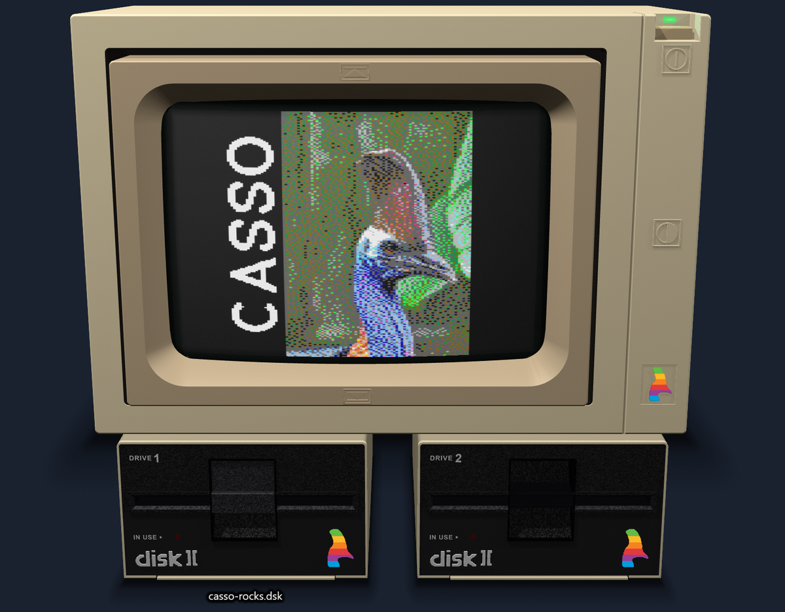</td>
  <td valign="top" width="50%">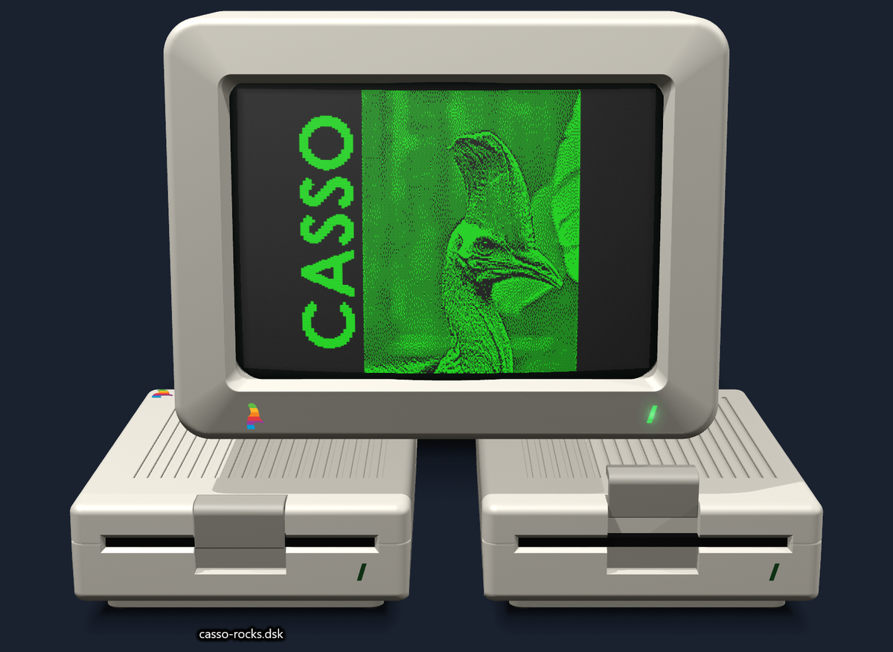</td>
</tr></table>

`CassoCli` accelerates the retro development loop, with no third-party tool in it:

- **Assembler** — from-scratch, AS65-compatible, and assembles Merlin; ca65 next
- **Disk management** — create, initialize, catalog, read and write files,
  logical or physical sectors, and ProDOS blocks, across `.woz`, `.dsk`, `.do`,
  `.po`, `.nib` and `.nb2`
- **Headless execution** — assemble and run 6502 code with no GUI
- **Launches the emulator** — with a machine and disks already selected

## Contents

- [What's New](#whats-new)
- [Features](#features)
- [Requirements](#requirements)
- [Quick Start](#quick-start)
- [Project Structure](#project-structure)
- [Assembler](docs/Assembler.md)
- [Architecture](ARCHITECTURE.md)
- [Why "Casso"?](#why-casso)
- [Acknowledgments and Attributions](#acknowledgments-and-attributions)
- [Contributing](#contributing)
- [License](#license)

## What's New

The last few releases, in brief. [CHANGELOG.md](CHANGELOG.md) has the granular
history, and [ARCHITECTURE.md](ARCHITECTURE.md) covers the emulator's internals.

### The skeuomorphic theme goes to 11 (1.21)

The skeuomorphic theme used to be a picture of a monitor drawn around the
emulator's output. It is now a room: four period devices modeled in CAD at
their real dimensions, standing on a desk, lit and shadowed, seen from a
seated person's eye about thirty inches from the screen. The perspective is
not a set of tuned constants; it falls out of where the hardware actually
is.

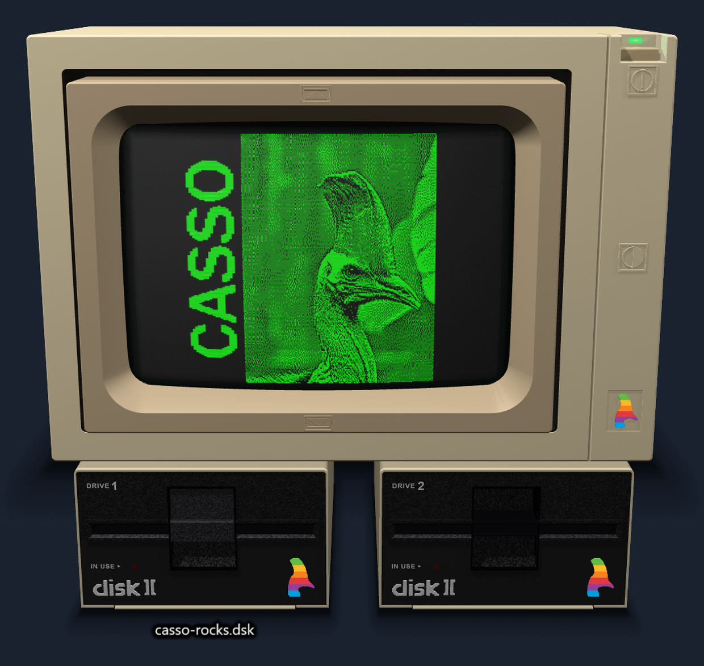

**Four devices, built from photographs.** An Apple Monitor II and Disk II
drives for the //e Enhanced, //e, ][+ and ][; a Monitor //c over Disk IIc
drives for the //c. Switching machines swaps the whole stack. Every part is a
3D CAD object rather than a mesh sculpted to look like one, so openings are
cuts through the case and every edge that should break over does. The marks
are modeled too, not painted on: the embossed tilt and brightness icons on the
bezel, the cassowary inlaid into its recess, DRIVE 1 and IN USE and the
`disk ][` logotype, the raised ribs on a drive's lid.

**The picture lies on the glass.** The emulator's output maps onto a
spherical-sag surface with the same curvature the actual tube has, with a
rounded faceplate mask and a dark border where the raster stops short of
the bezel. Input is inverse-projected back through that curvature, so a
click on a curved, foreshortened, possibly tilted screen still lands on the
exact emulated pixel underneath it.

| | |
|---|---|
| 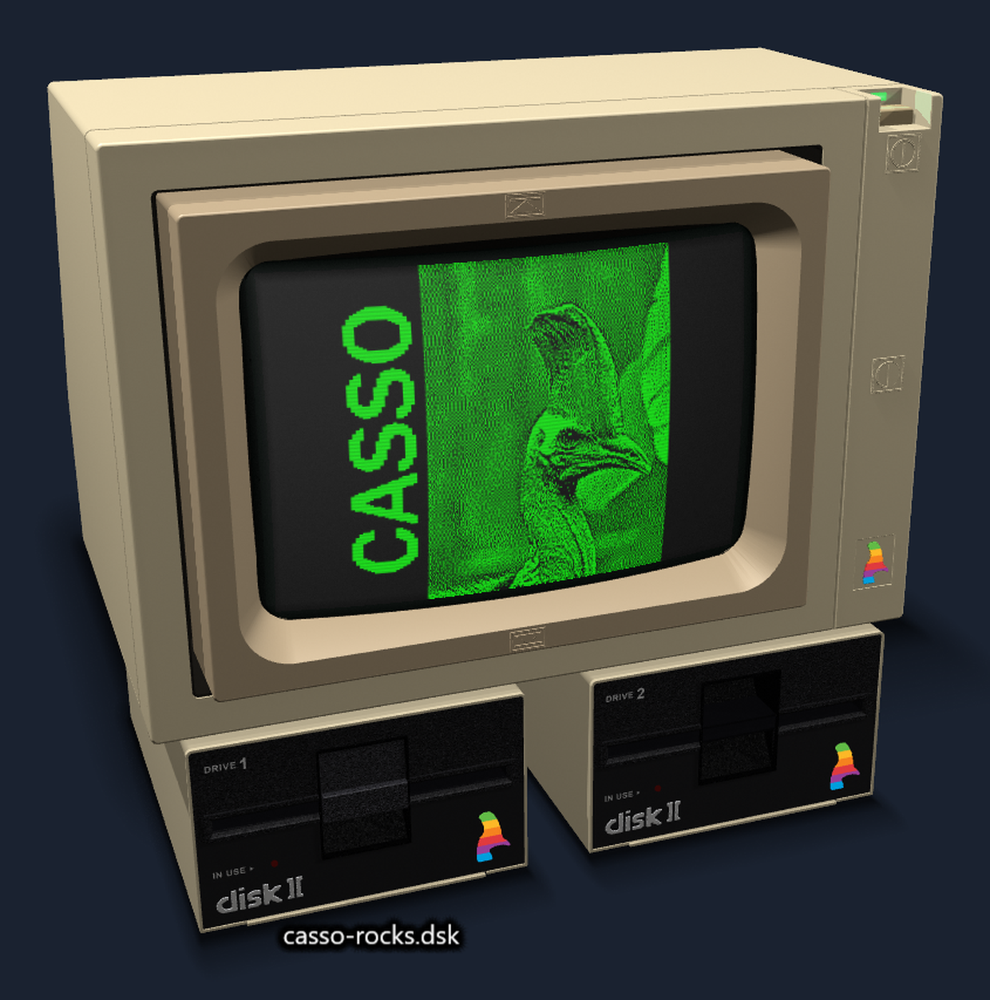 | 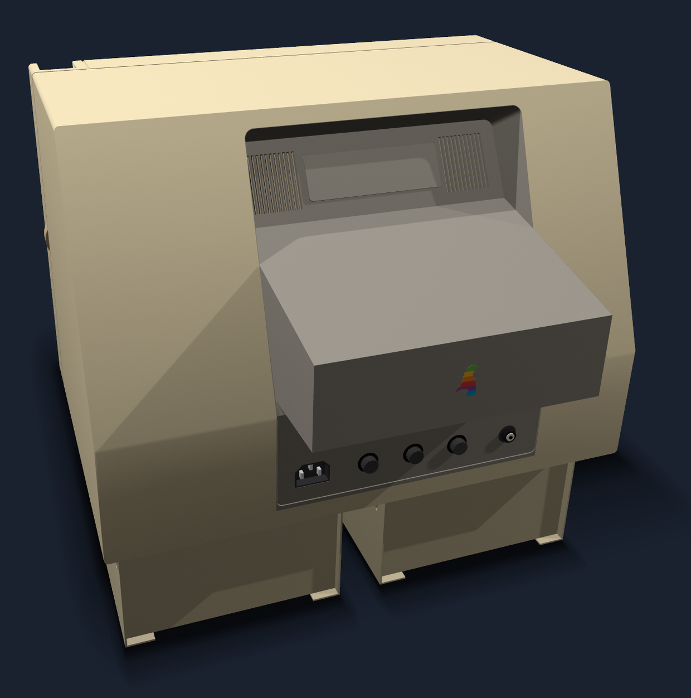 |

**You can walk around it.** Mouse, touch or trackpad, with the gestures you
would expect: drag to rotate, two fingers to pan, pinch to zoom. A compass
in the corner does the same for anyone who would rather click than drag--its
arrows rotate, hold one to keep going, and the orb squares everything back up.
Ctrl+0 resets.

That's why the backs are fully modeled too. The Monitor II's rear is one
piece of dark plastic running from the vent recess down over the control
panel, with the bell emerging through it, the vents looking into an unlit
interior, and the knobs, the AC receptacle and the video jacks where they
belong. The Monitor //c's rear panel is modeled control for control. You
may rarely look at either, but the scene lets you, so they had to be right.

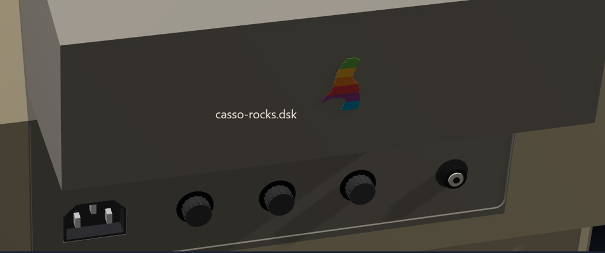

**The tilt bezel works.** Drag the up and down marks molded into the
Monitor II's bezel, and the bezel and tube pivot together, stopping flush
with the frame, just like the real one. Shadows and a subtle glare are
modeled across the tube's curved face and move with it. Where you leave the
tilt is remembered per monitor.

**The lamps are real lights.** The power indicator and the drives' activity
LEDs are light sources in the shading pass, not bright dots painted on:
they cast onto the housings around them and are occluded by the parts in
front of them. It's the little things....

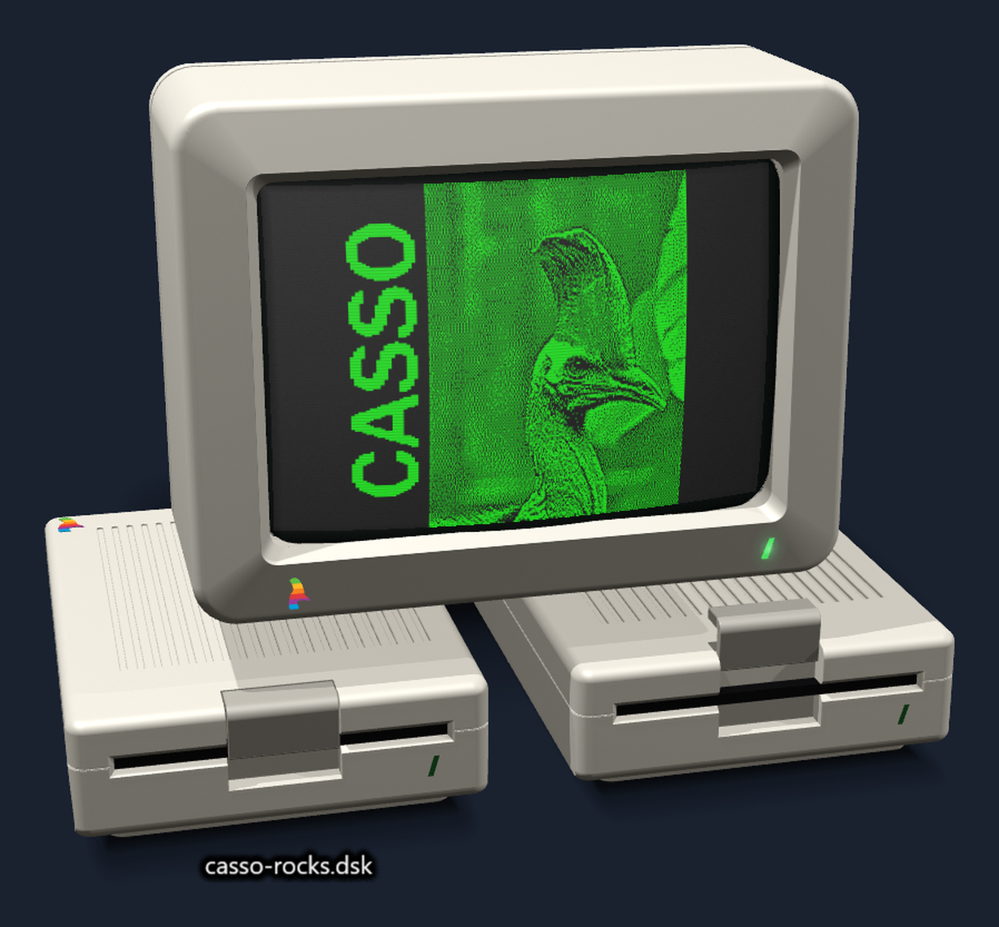

**The monitor decides the phosphor.** Green, amber, and white used to be a
display setting applied across every machine. Monitors are now the owners of
that setting, and machines are assigned period-accurate monitors by default.
Phosphor color and full color are still yours to change, and that change is
preserved per machine.

**Lit, shadowed, and GPU-efficient.** Two lights, a specular highlight and
per-pixel shading, with the power and drive LEDs acting as real lights rather
than a glow painted on nearby faces; shadows cast across the desk and a
contact shadow under each device. Drive doors animate on mount and eject, the
Disk II swings on its cantilever, the Disk IIc slides back and lifts clear of
the slot. To keep GPU use low the scene is cached, and when the screen stops
changing Casso stops drawing altogether.

### Disk file access from the command line (1.20)

The build loop no longer leaves the machine. `CassoCli disk` makes a disk, reads
files off it and puts them back, with no third-party tool anywhere in the loop.
Source to a running machine in six commands:

```powershell
CassoCli disk create mydisk.dsk --bootable
CassoCli as65 prog.a65 -oprog.bin
CassoCli disk put mydisk.dsk prog.bin --as PROG --type B --load $6000
CassoCli disk put mydisk.dsk greet.bas --as STARTUP --basic
CassoCli disk boot mydisk.dsk STARTUP
Casso.exe --machine Apple2e --disk1 mydisk.dsk
```

It runs in reverse too: `disk get` hands back a file byte-for-byte and reports the
load address DOS 3.3 doesn't keep in its catalog. `--basic` converts an Applesoft
listing to and from tokenized form, `--text` converts high-bit encoding and line
endings, and the default moves bytes unchanged, so extract-edit-replace perturbs
nothing the edit didn't touch.

For disks carrying no filesystem at all, `sectorread` and `sectorwrite` work at a
track and sector — stating `--logical` or `--physical`, because the same sixteen
sectors answer to two orders — and `blockread` / `blockwrite` do the same by
512-byte ProDOS block.

Writes are all-or-nothing. The complete image is built and checked in memory,
written beside the target, and put in place atomically, so a locked file, a full
volume, or a track that can't be re-encoded all leave the original byte-for-byte
as it was, with no temporary left behind. That is deliberately not symmetric with
the emulator: a mounted image isn't held open, so a disk mounted in Casso is
neither noticed nor protected, and the tool says so rather than implying
otherwise.

**The assembler's command line is now AS65's, exactly**, which changes behavior
scripts may depend on — see [CHANGELOG.md](CHANGELOG.md) before upgrading.

### The Mockingboard speaks (1.19)

The emulated Mockingboard is now the **Mockingboard C** by default on the ][+,
//e and //e Enhanced. A clean-room **SSI 263A** core written from the datasheet
provides the five attribute registers, all 64 phonemes, the documented timing
formulas, and formant synthesis, with the ready line on the VIA's CA1 where
speech drivers expect it. Sound-only software is untouched: the speech chip is an
additive tap on the real board's address decode and powers up in the part's own
silent Power Down state, so **Mockingboard A** behavior is byte-for-byte
unchanged. Boot `Apple2/Demos/mockingboard-speech-test.dsk` to hear it.

The chip's per-phoneme parameter ROM — never published, substituted for by every
emulator — has been **read off the visual6502 die photographs** and fully
decoded: 64 phonemes × 29 bits, six significance-interleaved 4-bit fields plus
closure, class, fricative and voiced flags, with the on-die column address decoder
read to prove the phoneme mapping. Cross-checking against the 2007 SC-01A decap
validated it end to end (22 of 46 name-matched phonemes carry identical formant
codes; closure agrees 46/46) and licensed that chip's measured capacitor network
as the code-to-Hz mapping. Data and method:
`specs/024-mockingboard-speech/rom-extraction/`.

### Monochrome graphics fidelity (1.18.1)

The green, amber and white monitors were showing a luminance-tinted copy of the
*color* decode — which has already thrown away the exact detail a monochrome
monitor exists to show. An isolated hi-res dot came out around 57% brightness
where hardware lights it fully, and the half-dot shift was lost. Both graphics
modes now decode for the monitor you picked.

Surfaced by [(Apple IIe) Sixies](https://dskilton.itch.io/apple-sixies), which
asks for 560×192 monochrome double-hi-res and was unreadable on every monitor
Casso offered. The same frame, white monitor and color:

<table align="center" width="100%"><tr>
  <td valign="top" width="50%">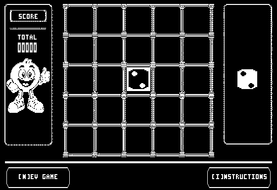</td>
  <td valign="top" width="50%">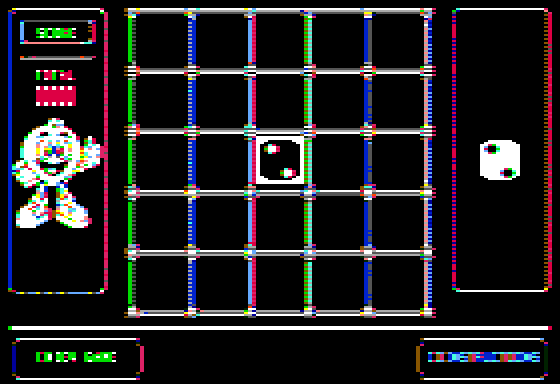</td>
</tr></table>

### Merlin assembler dialect (1.18)

`CassoCli` assembles **Merlin** source unmodified, with output verified
byte-for-byte against six objects shipped on the Merlin Pro 2.23 distribution
disk, including its own macro library. Merlin brings its field-based line model,
its own directive vocabulary, macros and variable symbols, local labels,
left-to-right unsigned 16-bit expressions, and a relocating origin.

The command line states the dialect rather than guessing it — `CassoCli as65
input.a65` and `CassoCli merlin PROG.S`. The bare `CassoCli input.a65` form is
gone. Under `as65` the CPU is chosen with AS65's own `-x`; under `merlin` the
source chooses it with `XC`. Where support ends is stated by name rather than
failing as a syntax error; see [docs/Assembler.md](docs/Assembler.md#where-merlin-support-ends).

### Salvage a damaged .woz (1.17)

Casso now checks disk integrity when a `.woz` is inserted. If the checksums are
wrong it treats the disk as read-only to prevent further corruption, and a Salvage
wizard offers to recover what it can into a structurally correct copy of the
original.

## Features

### Machines

Apple ][, ][+, //e, //e Enhanced, and //c, from data-driven machine configs in
`Machines/<Name>/<Name>.json`. The //e brings 80-column text, auxiliary RAM, and
an audit-correct Language Card state machine; the //e Enhanced and the //c run a
65C02. The //c models its slotless phantom-slot firmware map, the built-in IWM
drive plus a connectable external one, dual 6551 serial ports, and the //c mouse
driven by the machine's own mouse firmware. Its two latching case switches are
modeled on a control strip: **80/40** drives `$C060`, and the **keyboard** switch
flips the typed stream to Dvorak.

On first launch Casso fetches the ROMs, sample disks, and Disk II audio samples
it needs, with your consent, so a fresh `Casso.exe` boots to a usable BASIC
prompt with nothing installed by hand. `Machines/` and `Devices/` are fully
runtime-managed — delete either and the next launch rebuilds it.

### CPU

All 56 standard 6502 mnemonics plus the 65C02 set, and the stable undocumented
NMOS opcodes (SAX, LAX, DCP, ISC, SLO, RLA, SRE, RRA and the NOP family).
Cycle-accurate IRQ/NMI infrastructure. Validated against
[Klaus Dormann's functional test suite](https://github.com/Klaus2m5/6502_65C02_functional_tests)
(full pass) and [Tom Harte's SingleStepTests](https://github.com/SingleStepTests/ProcessorTests),
which check both what every instruction computes and what it costs in cycles.
The vectors are authored elsewhere, which makes them an independent oracle
rather than a restatement of our own assumptions. Per-opcode mnemonics,
addressing modes, lengths and cycle counts for both cores are in
[docs/cycle-reference.md](docs/cycle-reference.md), generated from the
instruction tables so it describes this build rather than a 6502 in general.

### Display

40- and 80-column text, Hi-Res and Double Hi-Res, rendered through D3D11. Color,
green, amber, and white monitors each decode for the monitor you picked rather
than tinting a color decode — on a monochrome monitor both graphics modes show
the full 560 half-dot stream.

Optional **CRT effects** — scanlines, phosphor bloom, color bleed, persistence
trails, contrast and gamma — each independently toggleable with its own sliders.
Per-monitor presets seed defaults, themes can override, and your tweaks persist
on top of either. The Settings popup gets out of the way as you scrub a control:
the panel fades and only the focused control stays opaque, so you can judge every
parameter change against live output.

<p align="center">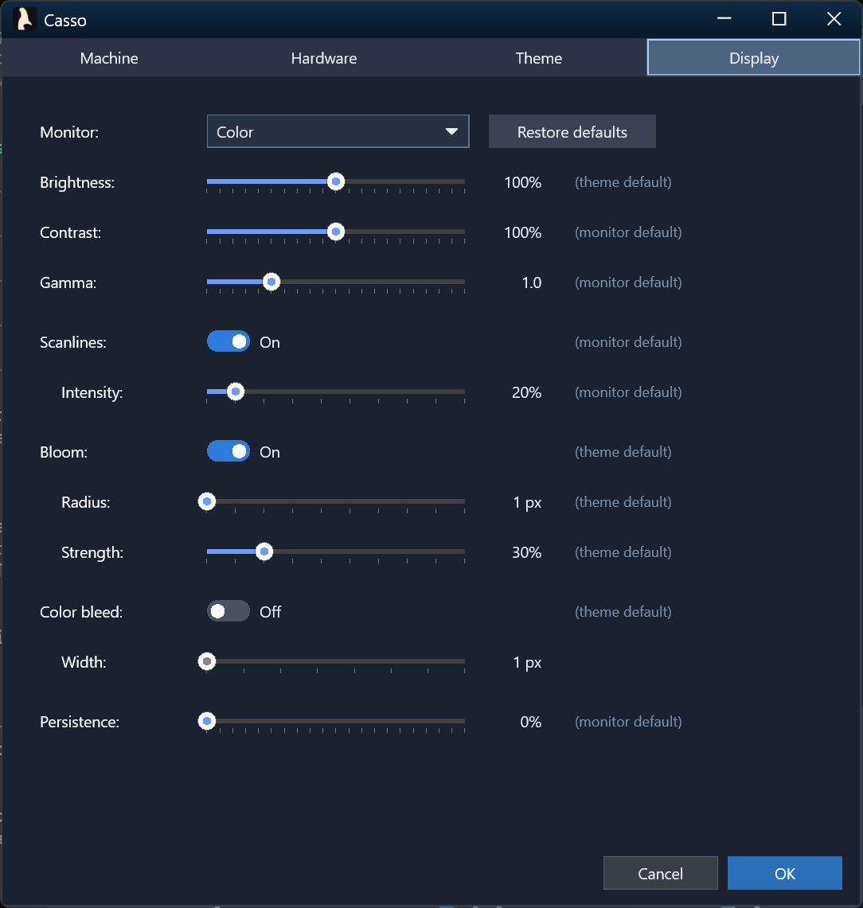</p>

An opt-in **CRT monitor desk scene** frames the display in a procedurally-drawn
period Apple Monitor //c, with the drives scaled to sit in proportion beneath it
and the whole scene zooming together as the window resizes.

<p align="center">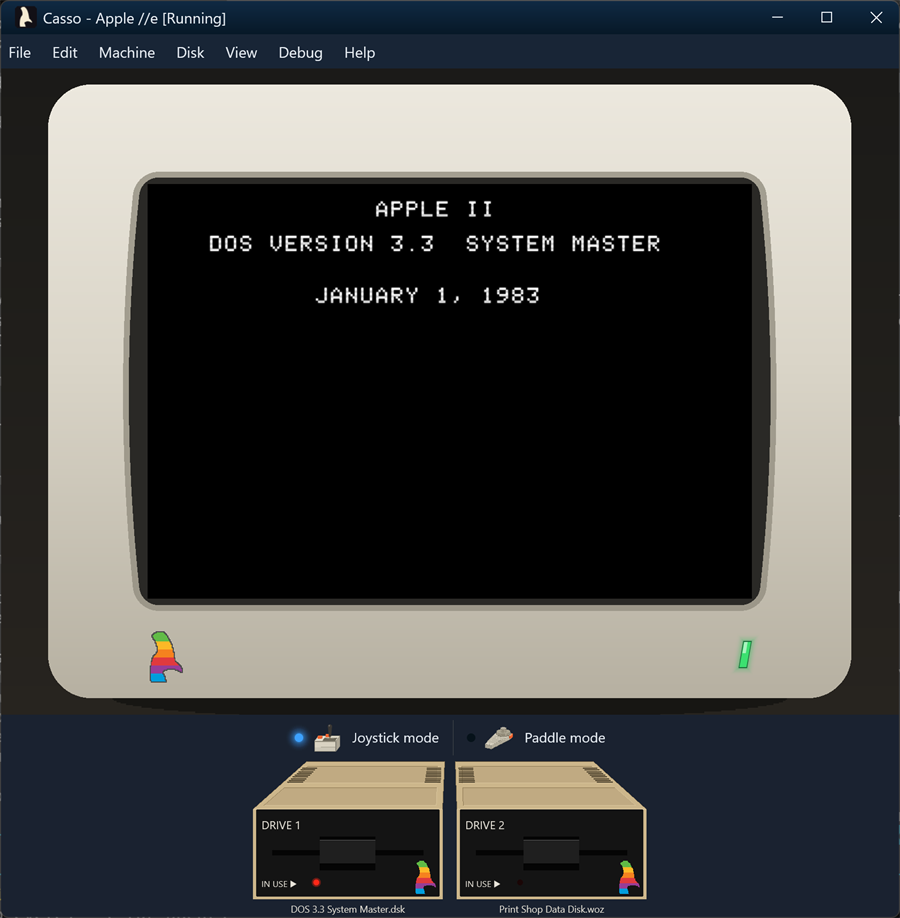</p>

### Themed chrome

Casso's entire UI renders onto the same D3D11 framebuffer that draws the
emulator video, through a native Direct2D / DirectWrite pipeline — no
third-party UI engine. **Three built-in themes** (Skeuomorphic, Dark Modern,
Retro Terminal) hot-swap from **Settings → Theme** with no restart and no
machine reset. Each ships under `Resources/Themes/<Name>/` with a `theme.json`
describing colors, CRT defaults, drive visuals, and other UI tokens; see
[docs/themes/AUTHORING.md](docs/themes/AUTHORING.md) for the authoring surface.

<p align="center">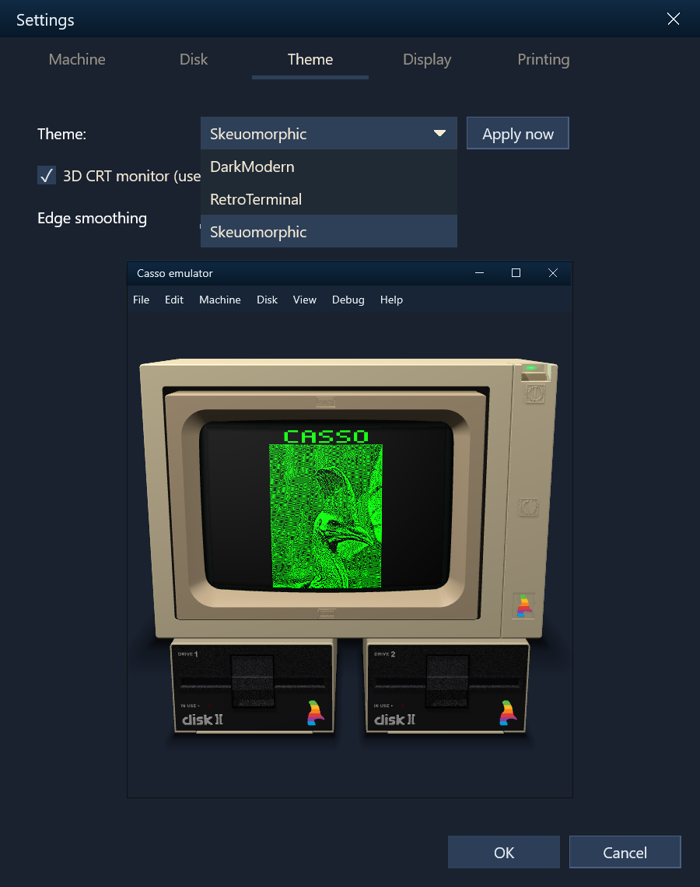</p>

**Skeuomorphic drive widgets** carry realistic Disk II faceplates: a
perspective-projected case top, vent slits, a cantilever door that tilts up and
back to reveal a recessed finger-pull, a status LED, and the rainbow cassowary
logo. Click a drive to pick an image or drag one onto it. A write-protected disk
shows a brass padlock, and hovering explains why it's protected.

<p align="center">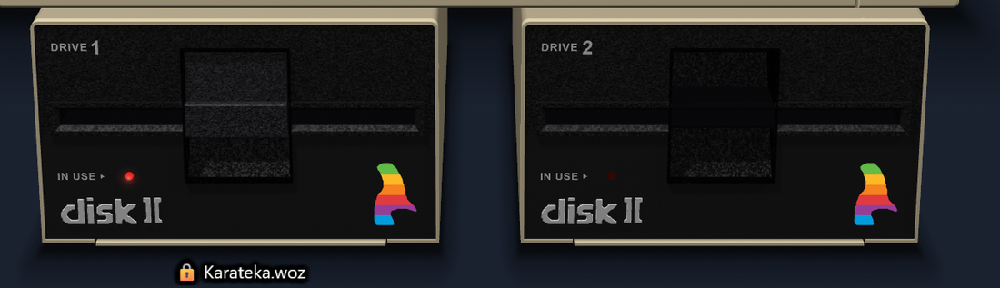</p>

A consolidated **Settings panel** holds machine selection, emulation speed, video
color mode, disk write mode, floppy sound and mechanism, write protect, the theme
picker, and the CRT controls, in one non-modal in-window panel with full keyboard
navigation. Preferences persist to `%LOCALAPPDATA%\Casso\UserPrefs.json` — global
UI state under `global`, per-machine deltas under `machines`.

<p align="center">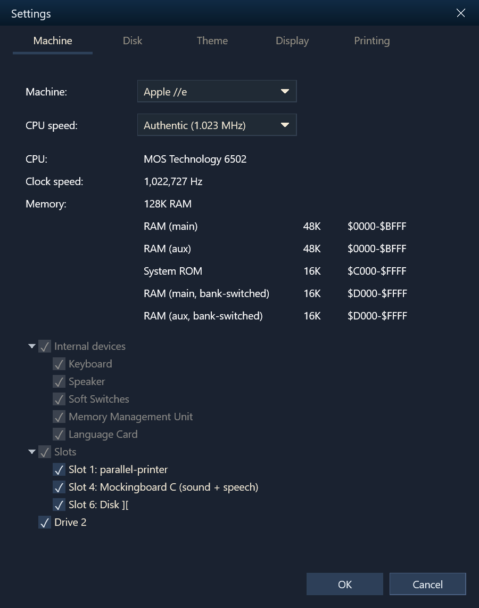</p>

Press **F10** to drive the painted chrome from the keyboard: a Tab focus ring
walks the menu titles, the Joystick Mode button, and the drive widgets, and never
leaks keystrokes through to the emulated keyboard.

### Disks

A Disk II controller that models quarter-track head positioning and the Logic
State Sequencer faithfully enough to boot original, copy-protected Broderbund WOZ
images straight off the wire — protection schemes and all.

| Karateka | Choplifter | Lode Runner |
| :---: | :---: | :---: |
| 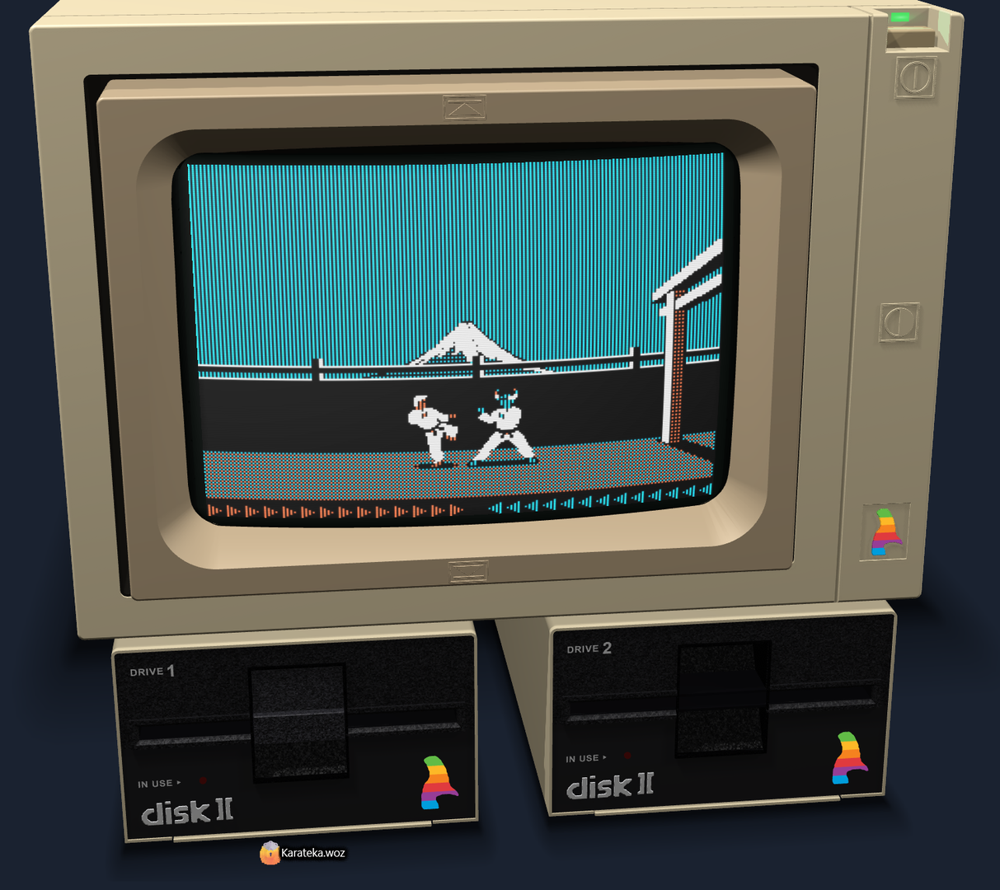 | 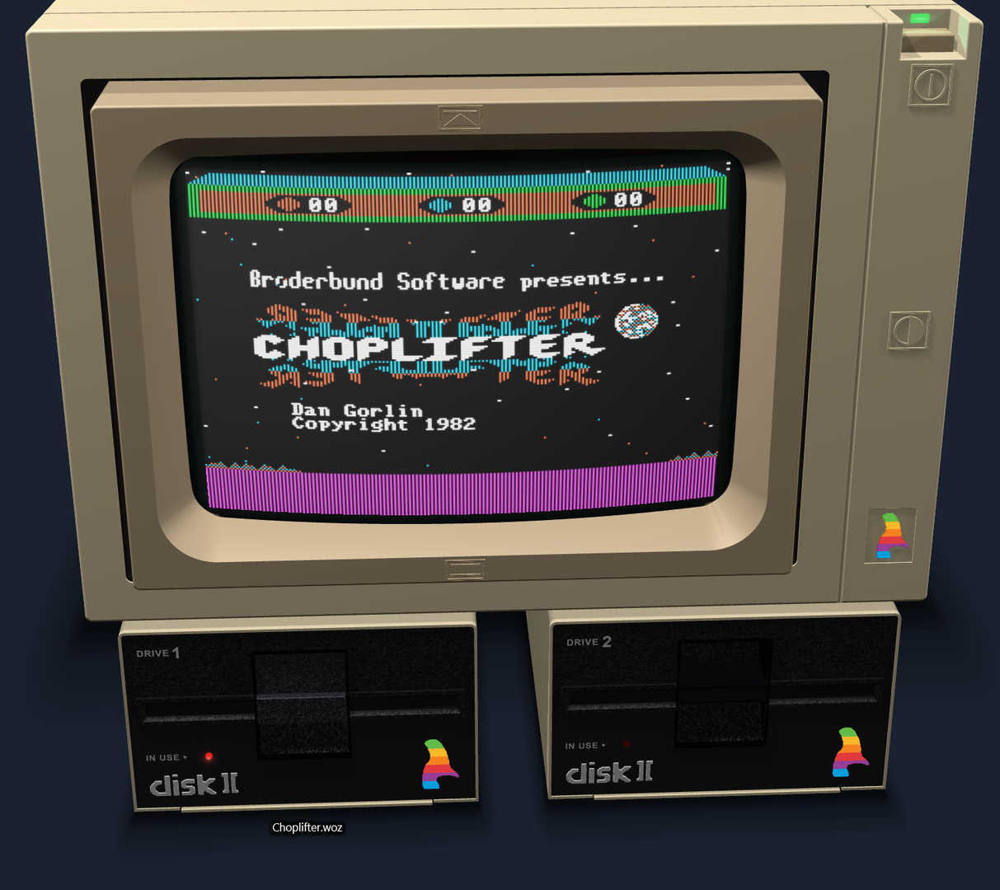 | 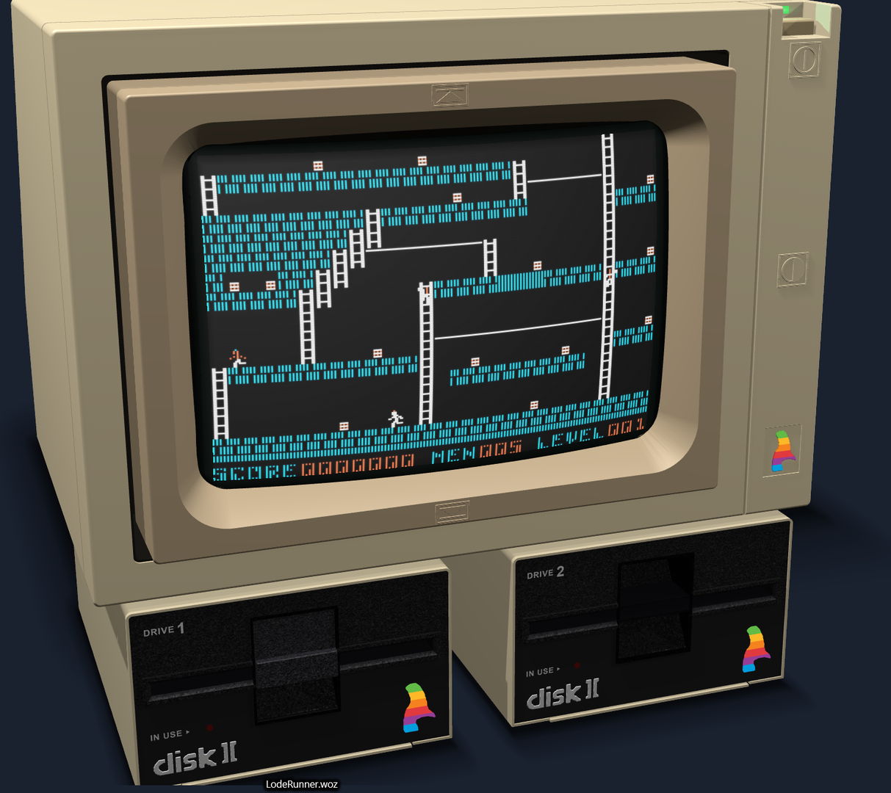 |

`.woz`, `.dsk`, `.do`, `.po`, `.nib` and `.nb2` images all mount — drag one onto a
drive, pick it from the dialog, or name it on the command line. Casso can **create
blank disks in-app** — DOS 3.3, ProDOS, or unformatted raw media, across WOZ, DSK,
PO and NIB, optionally bootable from the stock masters — and a created disk is
usable immediately, with no `INIT` step.

<p align="center">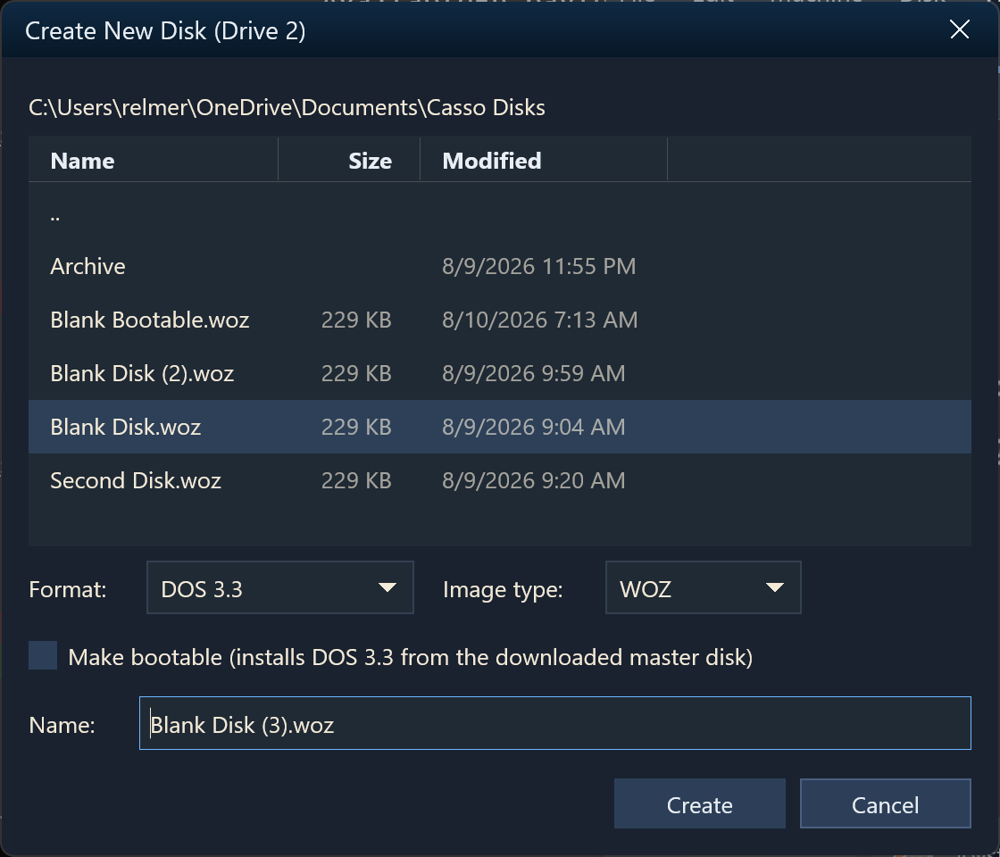</p>

Mounted disks carry a **write-protect toggle**: WOZ images hold the flag inside
the file so it travels with the image, sector formats use the host file's
read-only attribute, and a protected disk fails a guest `SAVE` with `WRITE
PROTECTED` just like the notch tab on real media. Dirty disks flush when the
drive motor spins down, so changes survive a crash or a force-quit.

Inserting a `.woz` checks its integrity. If the checksums are wrong Casso mounts
it read-only to prevent further loss and offers to **salvage** what it can into a
structurally correct copy.

<p align="center">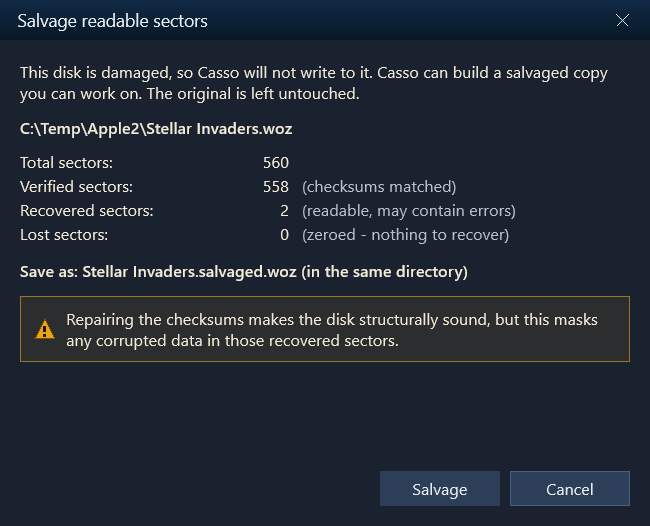</p>

### Sound

Speaker audio through WASAPI on a dedicated event-driven render thread that keeps
the device fed regardless of emulation cadence.

**Disk II mechanical audio** mixes in alongside it: stereo motor hum, head-step
clicks, track-0 and max-track bumps, insert and eject. Per-drive equal-power
panning places Drive 1 left and Drive 2 right in two-drive profiles. Contiguous
step bursts during DOS RWTS recalibration fuse into a continuous seek buzz
instead of N overlapping clicks. Recordings come from the
[OpenEmulator](https://github.com/openemulator/libemulation) project, downloaded
on first run with consent.

A **Mockingboard** in slot 4 of the ][+ and //e profiles, built from two
clean-room chip cores written off the datasheets: a reusable 6522 VIA and the
AY-3-8910 PSG (three tone voices, noise, envelope), with VIA Timer 1 driving the
periodic IRQs music players use for tempo. The default is the **Mockingboard C**
— the sound card plus Sweet Micro's speech option — and the **A** stays
selectable. *Ultima IV*, *Skyfox*, and *Music Construction Set* get their real
soundtracks back.

### Printer

A full **Apple ImageWriter II** on a parallel card in slot 1, default on the ][,
][+, //e and //e Enhanced. `PR#1` lists a BASIC program or `CATALOG`s a disk in
an original 95-glyph dot-matrix font, and The Print Shop prints banners, signs
and greeting cards in four-color glory, its command set locked from real byte
captures.

<p align="center">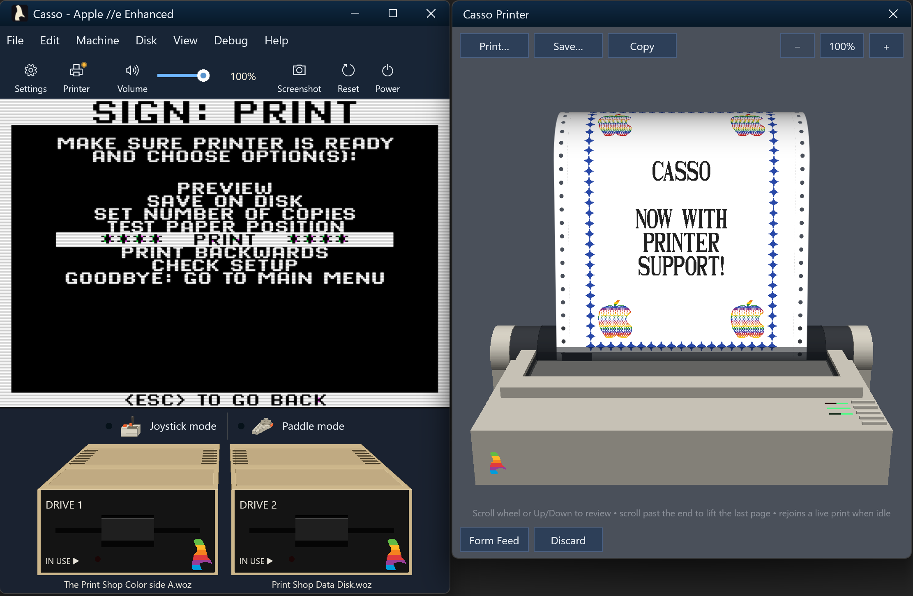</p>

Output appears in a live 3D preview — the project's own CAD model — with fanfold
paper, tractor-feed holes and perforations feeding out of the platen as you
watch. One print-head clock drives the whole illusion: the carriage sweeps
bidirectionally at true draft speed laying ink column by column, and the
[mechanical sound](https://github.com/BleuLlama/ImageWriterIISimulator) is gated
to what the head is actually doing. Any printout delivers three ways without
re-printing — **Save** as PNG, **Copy** to the clipboard, or **Print** to a real
Windows printer — and the paper stays loaded until you tear it off, so a pending
printout survives across sessions.

### Input

Analog game I/O via the PREAD timer, and a **Map Arrows to Joystick** mode that
puts the arrow keys on paddle 0/1 with **X** / **Z** on buttons 0/1, so
*Karateka*, *Choplifter* and *Lode Runner* play from the host keyboard with no
physical stick. The //e keyboard generates hardware-faithful auto-repeat — initial
delay, then steady cadence — rather than leaning on host-OS key repeat, so
timing-sensitive arrow input behaves the way it did on real hardware. An Input
Debug panel (**Ctrl+Shift+I**) logs host → guest key events, the `$C000`/`$C010`
strobe, Open/Closed-Apple state, and synthesized paddle reads.

### Assembler and CLI

`CassoCli` is a from-scratch reimplementation of Frank A. Vorstenbosch's **AS65**,
intended as a drop-in replacement: macros, conditional assembly, the full
expression evaluator, `equ`/`=` constants, `include`, the three-segment model,
AS65-style listings, and AS65's command line exactly — values attached to flags,
flag concatenation, `-x` for the 65C02, and exit codes 0 through 3 carrying the
meanings the AS65 manual gives them.

It also assembles **Merlin** (Glen Bredon's Merlin Pro), in the absolute subset
that needs no linker, verified byte-for-byte against six objects from the Merlin
Pro 2.23 distribution disk. A dialect is a directive table and a line model behind
one profile seam, sharing the two-pass engine, expression evaluator and opcode
tables — so the next dialect is a profile, not a second assembler.

Beyond assembling, a `run` subcommand loads and executes a binary or source, and a
`disk` subcommand closes the build loop: `create`, `init`, `list`, `get`, `put`,
`delete`, `boot`, `sectorread`, `sectorwrite`, `blockread` and `blockwrite`, on
DOS 3.3 and ProDOS volumes across `.dsk`, `.do`, `.po`, `.woz`, `.nib` and `.nb2`
alike.

Full reference: **[docs/Assembler.md](docs/Assembler.md)**.

### Testing

**4000+ unit tests** covering CPU encoding and addressing, assembler features,
the audio pipeline, the 6522 VIA and AY-3-8910, //e MMU and Language Card, video
timing, the Disk II nibble engine, WOZ and nibblized formats, DOS 3.3 and ProDOS
file read/write, the printer pipeline, and reset semantics.

`HeadlessHost` drives the emulator with no Win32 window for deterministic
integration tests — cold boot, disk boot, framebuffer hashing, reset. A separate
scenario suite boots a real 6502 over images the command line just wrote and
checks what the guest makes of them, because that is the only oracle for "the disk
is right" that our own reader cannot satisfy by agreeing with itself.

Harte vectors run at 200 per opcode on every build, checking each instruction's
final state and its cycle count, undocumented opcodes included; the full 10,000
per opcode are an opt-in download and are what you run when touching the CPU
core. See [docs/testing.md](docs/testing.md).

## Requirements

- Windows 10/11
- PowerShell 7 (`pwsh`) for build/test scripts
- Visual Studio 2026 (v18.x)
  - Workload: **Desktop development with C++**
  - Components: MSVC build tools, Windows SDK, C++ unit test framework
  - Optional: MSVC ARM64 build tools (for ARM64 builds)
- Optional: VS Code (repo includes `.vscode/` tasks)

## Quick Start

### Build

```powershell
# Build Debug for current architecture (Ctrl+Shift+B in VS Code)
.\scripts\Build.ps1

# Build Release
.\scripts\Build.ps1 -Configuration Release

# Build all platforms
.\scripts\Build.ps1 -Target BuildAllRelease

# Rebuild with code analysis (warnings as errors)
.\scripts\Build.ps1 -Configuration Release -RunCodeAnalysis
```

### Test

```powershell
# Build and run tests
.\scripts\RunTests.ps1

# Or use VS Code: Run Tests (current arch)
```

### Run the emulator

Run `Casso` with no arguments for an Apple II+ with an empty drive. ROMs and
sample disks are fetched on first launch, with your consent.

```powershell
# Launch the emulator (defaults to Apple II+)
Casso

# Pick a machine
Casso --machine Apple2e

# Boot a disk in drive 1
Casso --machine Apple2e --disk1 "Apple2\Demos\casso-rocks.woz"

# Both drives
Casso --machine Apple2c --disk1 "side-a.woz" --disk2 "side-b.woz"
```

Machine names come from `Resources/Machines/<Name>/`: `Apple2`, `Apple2Plus`,
`Apple2e`, `Apple2eEnhanced`, `Apple2c`. ROM images live under
`Machines/<Name>/` and shared device boot ROMs under `Devices/<Family>/`.

### Assemble and run

The dialect is required — `as65` is a subcommand, not an assumption. Every value
attaches to its flag, which is AS65's grammar; `-o` is the one switch where the
space before its value is optional. Full reference:
**[docs/Assembler.md](docs/Assembler.md)**.

```powershell
# Assemble a source file
CassoCli as65 input.a65 -ooutput.bin

# With a listing file and a symbol table
CassoCli as65 input.a65 -ooutput.bin -llisting.txt -t

# Motorola S-record (.s19) or Intel HEX (.hex)
CassoCli as65 input.a65 -s   -ooutput.s19
CassoCli as65 input.a65 -s2  -ooutput.hex

# The default output is the assembled bytes and nothing else. --flat pads to a
# full 64KB image at the origin; --dos-bin writes a BLOAD-ready DOS 3.3 binary.
CassoCli as65 input.a65 --flat     -ooutput.bin
CassoCli as65 input.a65 --dos-bin  -ooutput.bin

# Pre-define a symbol, or generate a listing with cycle counts
CassoCli as65 input.a65 -dDEBUG=1 -ooutput.bin
CassoCli as65 input.a65 -c -llisting.txt

# 65C02 source (STZ, BRA, RMB/SMB/BBR/BBS, ...). The default is a strict 6502;
# 65C02-only opcodes are rejected without -x.
CassoCli as65 input.a65c -x -ooutput.bin

# Merlin. Merlin derives its own object file, so -o only overrides the source,
# and there is no CPU flag: Merlin selects its CPU in the source with XC.
CassoCli merlin SOURCE.S
CassoCli merlin SOURCE.S -o OBJECT

# Assemble and run in one step. `run` specifies its assembler for the same reason
# assembling does: a source with neither flag is refused, not guessed at.
CassoCli run input.a65 --as65
CassoCli run PROG.S --merlin

# A binary names no assembler, because none reads it
CassoCli run output.bin --load $8000
```

## Project Structure

```
Casso.sln
├── CassoCore/     Static library — CPU emulator, assembler, parser, opcode table
├── CassoEmuCore/  Static library — Apple II devices, video modes, audio generator + drive-audio mixer
├── Dxui/          Static library — reusable Direct2D/DirectWrite UI framework (host window, panels, layouts, widgets, menu bar, popup host, dialogs)
├── Casso/         Win32 application — Apple II platform emulator (D3D11, WASAPI, Disk II audio)
├── CassoCli/      Console application — assembler CLI (`as65`, `merlin`) with `run` and `disk` subcommands
├── UnitTest/      Test DLL — Microsoft Native CppUnitTest (4000+ tests)
└── ScenarioTests/ Test DLL — system tests needing the DOS 3.3 System Master and a booted guest (`RunTests.ps1 -Scenario`)
```

## Why "Casso"?

While [emu](https://en.wikipedia.org/wiki/Emu) is the more obvious name and mascot for an emulator, I wanted Casso to stand out; to be just a little weird; to _think different_. I picked its larger, flightless, considerably more dangerous cousin: the [cassowary](https://en.wikipedia.org/wiki/Cassowary), Casso to his friends.

I thus present to you our regal namesake, revel in his splendor!

<p align="center">
  
</p>

*Cassowary photo by [Mr. Smiley / BunyipCo](https://bunyipco.blogspot.com/2015/04/cassowary-update.html), licensed under [CC BY-NC-SA 3.0](https://creativecommons.org/licenses/by-nc-sa/3.0/).*

## Acknowledgments and Attributions

Casso's correctness is validated against two exceptional open-source test suites:

- **[Klaus Dormann's 6502 Functional Test Suite](https://github.com/Klaus2m5/6502_65C02_functional_tests)**: [@Klaus2m5](https://github.com/Klaus2m5)'s exhaustive functional test exercises every documented 6502 behavior: all instructions, addressing modes, flag interactions, BCD arithmetic, and edge cases. Casso passes the full suite.
- **[Tom Harte's SingleStepTests](https://github.com/SingleStepTests/ProcessorTests)**: [@TomHarte](https://github.com/TomHarte)'s per-opcode test vectors run every legal 6502 opcode from a recorded initial state and compare the registers, flags, touched memory and **cycle count** against what the instruction really did. Every conditional cycle is covered, since each vector records what its own operands actually cost: page crossings, taken branches, and the 65C02's decimal `ADC`/`SBC` penalty. Casso passes all 151 legal-opcode test sets and every byte of the Rockwell 65C02 opcode map. What this still does not cover is *which* cycle a bus access lands on; the fixtures keep the length of the upstream per-cycle trace, not its contents.

Thank you to both authors for making these invaluable resources freely available. They are the gold standard for 6502 emulator validation.

Casso also builds on several third-party components and assets:

- **CRT display shaders**: the optional CRT effect is a set of HLSL ports from the [libretro `glsl-shaders`](https://github.com/libretro/glsl-shaders) collection: **crt-pi** by Davide Berra (MIT), the **ntsc-adaptive** chroma stage by Themaister and hunterk (MIT), and the **bloom** passes by hunterk (public domain). Per-file attribution and license terms are in [`Casso/Shaders/CRT/LICENSES.md`](Casso/Shaders/CRT/LICENSES.md).
- **[stb_vorbis](https://github.com/nothings/stb)**: Sean Barrett's public-domain Ogg Vorbis decoder ([nothings.org/stb_vorbis](http://nothings.org/stb_vorbis/)), used to decode the Disk II and printer audio samples.
- **ImageWriter II printer sounds**: recorded from a real ImageWriter II by [Scott Lawrence](https://github.com/BleuLlama/ImageWriterIISimulator), licensed under [CC BY 4.0](https://creativecommons.org/licenses/by/4.0/).
- **Disk II mechanical sounds**: recordings from the [OpenEmulator](https://github.com/openemulator/libemulation) project.

## Contributing

See [CONTRIBUTING.md](CONTRIBUTING.md) for commit conventions, build instructions, code style guidelines, and other contributor guidelines.

## License

[MIT](LICENSE)
