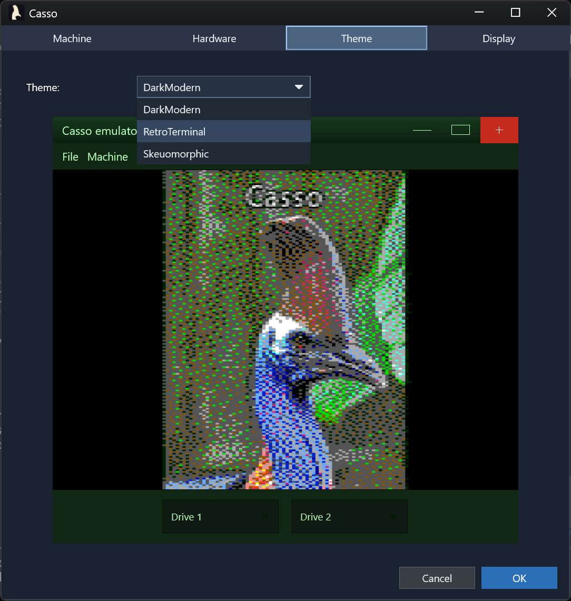
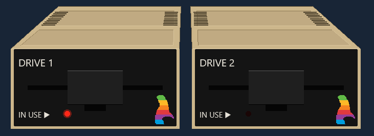
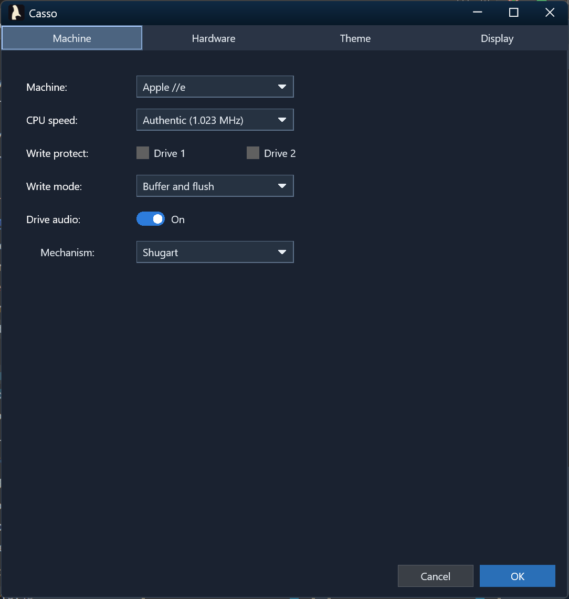

# What's New in Casso

The full write-ups for earlier releases, newest first. The most recent releases
are featured in [the README](../README.md#whats-new), and
[CHANGELOG.md](../CHANGELOG.md) lists every release, patch releases included.

Screenshots here were taken when each release shipped, so the older ones show
the UI as it was then.

| Date | Release | Highlights |
|---|---|---|
| 2026-09-10 | [1.24](#v1-24) | The //e's own character ROM, Applesoft round-trip fixes, and a faster //c startup |
| 2026-08-31 | [1.22](#v1-22) | Nibble images (`.nib`, `.nb2`), and disk decoding up to 100x faster |
| 2026-08-29 | [1.21](#v1-21) | A real-time 3D desk scene: period monitors and drives modeled in CAD, lit and shadowed |
| 2026-08-27 | [1.20](#v1-20) | `CassoCli disk`: make disks and move files on and off them, and AS65's exact command line |
| 2026-08-27 | [1.19](#v1-19) | The Mockingboard speaks, driven by the SSI 263A's own ROM read off the die photographs |
| 2026-08-25 | [1.18.1](#v1-18-1) | Monochrome monitors show all 560 dots of double hi-res |
| 2026-08-21 | [1.18](#v1-18) | Merlin source assembles unmodified, verified against the Merlin Pro disk |
| 2026-08-20 | [1.17](#v1-17) | Salvage a damaged `.woz` into a structurally correct copy |
| 2026-08-10 | [1.16](#v1-16) | Create blank, bootable disks in the app, and a write-protect toggle |
| 2026-07-28 | [1.15](#v1-15) | MousePaint works again on the //c |
| 2026-07-26 | [1.14](#v1-14) | An emulated ImageWriter II with a live 3D preview and real print-head sound |
| 2026-07-25 | [1.13](#v1-13) | Emulation and rendering performance |
| 2026-07-22 | [1.12](#v1-12) | The first skeuomorphic CRT monitor |
| 2026-07-19 | [1.11](#v1-11) | The stable undocumented 6502 opcodes, validated against Harte |
| 2026-07-18 | [1.10](#v1-10) | The //c's 80/40 and keyboard switches |
| 2026-07-16 | [1.9](#v1-9) | Write-protect indicator |
| 2026-07-15 | [1.8](#v1-8) | The Apple //c and //e Enhanced, on a new 65C02 core |
| 2026-07-12 | [1.7](#v1-7) | Mockingboard sound card |
| 2026-07-08 | [1.6.2](#v1-6-2) | Reliable disk writes |
| 2026-07-07 | [1.6](#v1-6) | Disk picker search, and the Dxui UI library |
| 2026-06-03 | [1.5.1523](#v1-5-1523) | Play action games from the keyboard, with hardware-faithful auto-repeat |
| 2026-05-30 | [1.5.1395](#v1-5-1395) | Themed first-run downloads |
| 2026-05-30 | [1.5.1289](#v1-5-1289) | Copy-protected Broderbund games boot from unmodified images |
| 2026-05-26 | [1.4.1171](#v1-4-1171) | Themed chrome, CRT effects, and skeuomorphic drives |
| 2026-05-15 | [1.3.670](#v1-3-670) | Disk II mechanical audio |
| 2026-05-09 | [1.3.509](#v1-3-509) | Apple //e fidelity: aux RAM, the Language Card, and a cycle-accurate Disk II |
| 2026-05-03 | [1.0.244](#v1-0-244) | The first GUI emulator, for the Apple ][, ][+ and //e |
| 2026-04-28 | [0.9.32](#v0-9-32) | An AS65-compatible assembler, and a Harte-validated 6502 |
| 2024-11-24 | [My6502](#origin) | Where it started: a 6502 emulator |

<a id="v1-24"></a>
## [2026-09-10 · 1.24] Bug fixes during a major refactor

A round of fixes that landed alongside a large internal refactor:

- The Apple //e now uses its own character ROM. It had been using the //e
  Enhanced ROM.
- `disk get --basic` lists an Applesoft file whose recorded length runs past
  the end-of-program link, and both `--basic` directions pass a control
  character inside a string, a REM or a DATA statement through as the byte
  Applesoft stores. Both used to stop with an error.
- Starting, power-cycling or rebooting a //c no longer pauses for a second
  before the drive starts.
- Ctrl-Open-Apple-Reset from the toolbar, the Machine menu or the //c strip
  cold starts with normal key timing, instead of needing the keys held down for
  several seconds after the click.
- Switching machines no longer crashes when a frame is presented during the
  rebuild.

<a id="v1-22"></a>
## [2026-08-31 · 1.22] Nibble images, and faster disk decoding

Nibble disk images (`.nib` and `.nb2`) mount alongside `.woz`, `.dsk`, `.do`
and `.po`. Disk decoding also got faster for every image format: about 2x on
formatted tracks and about 100x on unformatted ones.

<a id="v1-21"></a>
## [2026-08-29 · 1.21] The skeuomorphic theme goes to 11

The skeuomorphic theme used to be a picture of a monitor drawn around the
emulator's output. It is now a room: four period devices modeled in CAD at
their real dimensions, standing on a desk, lit and shadowed, seen from a
seated person's eye about thirty inches from the screen. The perspective is
not a set of tuned constants; it falls out of where the hardware actually
is.


**Four devices, built from photographs.** An Apple Monitor II and Disk II
drives for the //e Enhanced, //e, ][+ and ][; a Monitor //c over Disk IIc
drives for the //c. Switching machines swaps the whole stack. Every part is a
3D CAD object rather than a mesh sculpted to look like one, so openings are
cuts through the case and every edge that should break over does. The marks
are modeled too, not painted on: the embossed tilt and brightness icons on the
bezel, the cassowary inlaid into its recess, DRIVE 1 and IN USE and the
`disk ][` logotype, the raised ribs on a drive's lid.

**The picture lies on the glass.** The emulator's output maps onto a
spherical-sag surface with the same curvature the actual tube has, with a
rounded faceplate mask and a dark border where the raster stops short of
the bezel. Input is inverse-projected back through that curvature, so a
click on a curved, foreshortened, possibly tilted screen still lands on the
exact emulated pixel underneath it.

| | |
|---|---|
|  |  |

**You can walk around it.** Mouse, touch or trackpad, with the gestures you
would expect: drag to rotate, two fingers to pan, pinch to zoom. A compass
in the corner does the same for anyone who would rather click than drag--its
arrows rotate, hold one to keep going, and the orb squares everything back up.
Ctrl+0 resets.

That's why the backs are fully modeled too. The Monitor II's rear is one
piece of dark plastic running from the vent recess down over the control
panel, with the bell emerging through it, the vents looking into an unlit
interior, and the knobs, the AC receptacle and the video jacks where they
belong. The Monitor //c's rear panel is modeled control for control. You
may rarely look at either, but the scene lets you, so they had to be right.


**The tilt bezel works.** Drag the up and down marks molded into the
Monitor II's bezel, and the bezel and tube pivot together, stopping flush
with the frame, just like the real one. Shadows and a subtle glare are
modeled across the tube's curved face and move with it. Where you leave the
tilt is remembered per monitor.

**The lamps are real lights.** The power indicator and the drives' activity
LEDs are light sources in the shading pass, not bright dots painted on:
they cast onto the housings around them and are occluded by the parts in
front of them. It's the little things....


**Each monitor sets its own phosphor color.** Green, amber, and white used to
be a display setting applied across every machine. Monitors are now the owners
of that setting, and machines are assigned period-accurate monitors by default.
Phosphor color and full color are still yours to change, and that change is
preserved per machine.

**Lit, shadowed, and GPU-efficient.** Two lights, a specular highlight and
per-pixel shading, with the power and drive LEDs acting as real lights rather
than a glow painted on nearby faces; shadows cast across the desk and a
contact shadow under each device. Drive doors animate on mount and eject, the
Disk II swings on its cantilever, the Disk IIc slides back and lifts clear of
the slot. To keep GPU use low the scene is cached, and when the screen stops
changing Casso stops drawing altogether.

**If a desk is not what you want, two flat themes ship alongside it.** Dark
Modern and Retro Terminal drop the room for a menu, a toolbar and a slim drive
bar, so the picture gets the window. Switch from **Settings → Theme** with no
restart and no machine reset. Both are shown
[at the top of the README](../README.md#casso), and
[Themed chrome](../README.md#themed-chrome) has the details.

<a id="v1-20"></a>
## [2026-08-27 · 1.20] Disk file access from the command line

The build loop no longer leaves the machine. `CassoCli disk` makes a disk,
reads files off it and puts them back: `create`, `init`, `list`, `get`, `put`,
`delete` and `boot`, on DOS 3.3 and ProDOS volumes, in `.dsk`, `.do`, `.po` and
`.woz` images alike, with no third-party tool anywhere in the loop. Source to a
running machine, in six commands:

```powershell
CassoCli disk create mydisk.dsk --bootable
CassoCli as65 prog.a65 -oprog.bin
CassoCli disk put mydisk.dsk prog.bin --as PROG --type B --load $6000
CassoCli disk put mydisk.dsk greet.bas --as STARTUP --basic
CassoCli disk boot mydisk.dsk STARTUP
Casso.exe --machine Apple2e --disk1 mydisk.dsk
```

(1.23 cut that to three, by letting the assembler write straight onto the
disk.)

It runs in reverse too. `disk get` hands back a file byte-for-byte and reports
the load address DOS 3.3 does not keep in its catalog, and `--basic` returns a
tokenized Applesoft program as a listing you can edit. `--text` converts the
high-bit encoding and line endings, and with neither, the default moves bytes
unchanged, so extract-edit-replace perturbs nothing the edit did not touch.
`--bootable` copies an operating system onto the disk, using the master disk
the emulator already downloaded.

For disks that carry no filesystem at all, such as a demo that boots its own
loader off track 0, `sectorwrite` lays bytes at a track and sector and
`sectorread` takes them back. Both take `--logical` or `--physical` every time,
because the same sixteen sectors have two numberings. `blockread` and
`blockwrite`, added in 1.20.1, do the same by 512-byte ProDOS block.

**The assembler's command line is now AS65's, exactly.** Values attach to their
flags, flags chain into one argument, `-x` selects the 65C02, and exit codes 0
through 3 carry the meanings the AS65 manual gives them, so a build script
written for AS65 branches correctly here without being read again. **This
changes behavior scripts may depend on; see [CHANGELOG.md](../CHANGELOG.md)
before upgrading.** The help is tiered to match: `CassoCli --help` is one screen
listing the three modes, and each mode's flags, examples and exit codes are in
that mode's own help. PowerShell cuts `-oprog.bin` in half on the way in,
and Casso rejoins the two halves.

**Command-line writes are all-or-nothing.** The complete new image is built and
checked in memory, written beside the target, and put in place atomically, so a
locked file, a write-protected image, a volume with no room, a track that
cannot be re-encoded, or the image changing underneath all leave the original
byte-for-byte as it was, with no temporary left behind.

**That is deliberately not symmetric with the emulator.** A disk edited by a
running guest is written back when the drive flushes, and a flush interrupted
partway carries no such guarantee. Nor does either side detect the other:
`disk put` stops when some *other* program holds the image open, but a mounted
image is not held open, so a disk mounted in Casso is neither noticed nor
protected.

<a id="v1-19"></a>
## [2026-08-27 · 1.19] The Mockingboard speaks

The emulated Mockingboard is now the **Mockingboard C**, the sound card plus
Sweet Micro's speech option, by default on the ][+, //e and //e Enhanced. A
clean-room **SSI 263A** core written from the chip's datasheet provides the five
attribute registers, all 64 phonemes, the documented timing formulas, and
formant synthesis, with the ready line on the VIA's CA1 where speech drivers
expect it. Sound-only software is untouched: the speech chip is an additive tap
on the real board's address decode, and it powers up in the part's own silent
Power Down state, so the **Mockingboard A** behavior every existing title sees
is byte-for-byte unchanged. The A is still selectable as the `mockingboard`
device type. Boot `Apple2/Demos/mockingboard-speech-test.dsk` to hear it speak.

The chip's own per-phoneme parameter ROM, never published and substituted for
by every emulator, has been **read off the visual6502 die photographs** and
fully decoded: 64 phonemes × 29 bits, six significance-interleaved 4-bit fields
(F1/F2/F3 filter codes, vocal and fricative amplitudes, nasal coupling) plus
closure, class, fricative and voiced flags, with the on-die column address
decoder read to prove the phoneme mapping.

1.20.1 closed the last approximation. Cross-checking the extraction against the
2007 SC-01A decap showed the two chips share one parameter code scale: of the 46
phonemes the two chips have in common, 22 carry identical formant codes, and
the closure flag agrees on all 46. That validates the extraction end to end and lets the SC-01's
measured capacitor network serve as the code-to-Hz mapping, so the voice's
frequencies are now silicon-derived too. AH1's F1 code lands on 731 Hz; the
textbook value for "father" is 730. Data and method are in
`specs/024-mockingboard-speech/rom-extraction/`.

The same push fixed the long-standing audio clicks
([relmer/Casso#125](https://github.com/relmer/Casso/issues/125)): rendering now
runs on a dedicated event-driven WASAPI thread that keeps the device fed
regardless of emulation cadence, verified glitch-free by loopback capture.

<a id="v1-18-1"></a>
## [2026-08-25 · 1.18.1] Monochrome graphics fidelity

The green, amber and white monitors were showing a luminance-tinted copy of the
*color* decode, which has already thrown away the exact detail a monochrome
monitor exists to show. An isolated hi-res dot came out around 57% brightness
where hardware lights it fully, and the half-dot shift was lost. Both graphics
modes now decode for the monitor you picked.

Surfaced by [(Apple IIe) Sixies](https://dskilton.itch.io/apple-sixies), which
requires 560×192 monochrome double hi-res and was unreadable on every monitor
Casso offered. The same frame, white monitor and color:

<table align="center" width="100%"><tr>
  <td valign="top" width="50%"></td>
  <td valign="top" width="50%"></td>
</tr></table>

<a id="v1-18"></a>
## [2026-08-21 · 1.18] Merlin assembler dialect

`CassoCli` now assembles **Merlin** source (Glen Bredon's Merlin Pro, the
assembler most Apple II software of the era was written in) unmodified, with
the output verified byte-for-byte against six objects shipped on the Merlin Pro
2.23 distribution disk, including its own macro library. Merlin brings its
field-based line model, its own directive vocabulary, macros and variable
symbols, local labels, left-to-right unsigned 16-bit expressions, and a
relocating origin.

Merlin arrives as a *dialect*: a directive vocabulary and a line model behind
one profile seam, sharing the two-pass engine, expression evaluator and opcode
tables that `as65` has always used, so the next dialect is a profile rather
than a second assembler.

The command line states the dialect rather than guessing it: **`CassoCli as65
input.a65`** and **`CassoCli merlin PROG.S`**. The old bare `CassoCli
input.a65` form is gone, and `run` takes **`--as65`** or **`--merlin`** to select
the assembler for a source. Under `as65`, the CPU is chosen with AS65's own
**`-x`**; under `merlin`, the source chooses it with `XC`, as Merlin does.
Merlin output can be wrapped for an Apple II disk with **`--dos-bin`**, and
`-d NAME=value` supplies the values a `KBD` directive would have read from
the keyboard.

The rest of the CLI got a pass while the hood was up: `--help` wraps to the
width of your terminal and is organized by mode; an unknown argument stops the
tool with the full usage and the offending argument quoted last, instead of a
warning that it was ignored; the five output formats are mutually exclusive;
`-w` wraps the listing; `-t` shows decimal beside hex; and `-g` writes its
symbols by address and again by name. See
[Assembler.md](Assembler.md#where-merlin-support-ends) for where Merlin support
ends.

<a id="v1-17"></a>
## [2026-08-20 · 1.17] Salvage a damaged .woz

Casso now checks disk integrity when a `.woz` is inserted. If the checksums are
wrong, it treats the disk as read-only to prevent further corruption or data
loss, and a Salvage wizard offers to recover what it can into a structurally
correct copy of the original.

<p align="center"></p>

<a id="v1-16"></a>
## [2026-08-10 · 1.16] Create blank disks, and a write-protect toggle

<p align="center"></p>

The missing keystone of the write workflow: Casso can now make fresh disks. The
insert-disk picker's pinned **`<Create new disk...>`** row opens a themed
save-style dialog. Browse folders right in the dialog, pick the format
(**DOS 3.3**, **ProDOS 1.1.1**, or unformatted raw media) and the image type
(**WOZ**, **DSK**, or **PO**; only legal pairings are offered), give the file a
name, and the new disk mounts straight into the drive that opened the picker.

A created disk is immediately usable: `SAVE` and `CATALOG` work with no `INIT`
step, exactly like a disk a period formatter produced. A **Make bootable**
checkbox installs the real OS from the stock master disks, downloaded on
demand, so DOS 3.3 disks boot to a clean Applesoft prompt and ProDOS disks boot
through `PRODOS` into BASIC.SYSTEM. The dialog won't overwrite a disk that is
mounted in a drive, confirms overwrites and drive replacement, and reopens in
the folder you last created in.

Alongside it comes a **write-protect toggle** for mounted disks. The Disk menu
quotes its target: "Write-protect *"Blank Disk.woz"*" becomes "Allow writes to
*"Blank Disk.woz"*" once the disk is protected. WOZ images carry the flag inside
the file, so it travels with the image; sector formats use the host file's
read-only attribute. The drive widget's brass padlock and its tooltip track
every change, and a protected disk fails a guest `SAVE` with
`WRITE PROTECTED`, just like the notch tab on real media.

<a id="v1-15"></a>
## [2026-07-28 · 1.15] MousePaint works again on the //c

Fixed a //c mouse-interrupt bug that made **MousePaint** unusable: menus and
tools ignored every click and the cursor lagged. The //c only partially decodes
its paddle-timer strobe, so *any* `$C070`–`$C07F` access clears the VBL
interrupt, but Casso recognized only the literal `$C070`. Mouse apps that
acknowledge the VBL with a `$C07x` write (MousePaint writes `$C079` on each
interrupt) therefore never cleared it, and the resulting interrupt storm starved
the app of CPU. The per-instruction cost of the //c mouse tick also dropped by
about 31%.

<a id="v1-14"></a>
## [2026-07-26 · 1.14] Emulated ImageWriter II printer

<p align="center"></p>

Casso now emulates a full **Apple ImageWriter II** dot-matrix printer, end to
end. A parallel printer card sits in slot 1 by default on the ][, ][+, //e and
//e Enhanced, and the guest can print for real. `PR#1` lists a BASIC program or
`CATALOG`s a disk in an original 95-glyph dot-matrix font. The Print Shop prints
its banners, signs and greeting cards in full four-color glory, with the command
set locked from real Print Shop byte captures: ESC-G and ESC-L bit images, the
seven-color ribbon with overprint composites, and the documented pitch and
line-spacing family.

Print output appears in a **live skeuomorphic preview**: a real-3D ImageWriter
II, built from the project's own CAD model, with fanfold paper, tractor-feed
holes and perforations, feeding out of the platen as you watch. A single
print-head clock drives the whole illusion. The carriage sweeps bidirectionally
at true draft speed, laying ink column by column, and the paper feeds with the
head parked. The **mechanical sound** (authentic ImageWriter II recordings by
[Scott Lawrence](https://github.com/BleuLlama/ImageWriterIISimulator)) follows
what the head is actually doing: a carriage buzz over ink, line-feed clacks,
page feeds and tear-offs, stereo-panned to the window. A one-page viewport
follows the newest rows; scroll back to review earlier pages and it snaps to
the live row once printing idles.

Any printout can be delivered three ways without printing it again: **Save** as
a PNG, **Copy** to the clipboard, or **Print** to a real Windows printer, with a
paginated print preview. The paper stays loaded until you tear it off, so a
pending printout even survives across sessions.

<a id="v1-13"></a>
## [2026-07-25 · 1.13] Emulation and render performance

A performance pass across the hot paths that run on every emulated instruction
and every drawn frame. On the CPU side, memory reads serve RAM and ROM inline
from a page table instead of a virtual dispatch, I/O decodes through a direct
device map instead of scanning the device list, the language-card
(`$D000`–`$FFFF`) and //c internal-ROM (`$C100`–`$CFFF`) windows are
page-mapped, and the interrupt poll, video-timing tick and //c mouse tick shed
redundant per-instruction work. A steady machine idles at noticeably lower CPU,
most visibly on the //c.

On the render side, the 40- and 80-column text screens repaint only the rows
that actually changed, so a scrolling catalog or a blinking cursor no longer
redraws all 24 rows. The UI chrome caches its shaped text and geometry instead
of shaping every label again each frame, and the Mockingboard skips synthesis
while fully muted.

<a id="v1-12"></a>
## [2026-07-22 · 1.12] Skeuomorphic CRT monitor

An opt-in **CRT monitor desk scene**, a checkbox on **Settings → Theme** in the
skeuomorphic theme, frames the emulator display in a procedurally drawn period
**Apple Monitor //c**: a snow-white platinum shell, a chunky even bezel with
straight sides and slightly bowed glass, a recessed screen, and the rainbow
cassowary and a lit power lamp on the chin. The display sits inside the glass
at true 100% zoom, the drives scale to sit in proportion beneath it, and the
whole scene zooms together as the window resizes.

<p align="center"></p>

This was the first step toward the 3D desk scene that replaced it in 1.21.

<a id="v1-11"></a>
## [2026-07-19 · 1.11] Undocumented 6502 opcodes

The CPU now executes the stable undocumented NMOS 6502 opcodes that real Apple
II software relies on: SAX, LAX, DCP, ISC, SLO, RLA, SRE and RRA across their
addressing modes, plus the implied, 2-byte and 3-byte NOP family. Each is
validated against the Tom Harte SingleStepTests, 10,000 vectors per opcode, and
is built from the existing ALU primitives so flag and decimal-mode behavior
comes along for free. The unstable "magic constant" opcodes (ANE, LXA, SHA,
SHX, SHY and TAS) remain unimplemented by design, and the undocumented opcodes
are hidden from the assembler, so `NOP` still assembles to `$EA`.

<a id="v1-10"></a>
## [2026-07-18 · 1.10] The //c case-switch strip

The two latching switches on the //c case are modeled on a skeuomorphic control
strip in the //c's platinum case color. The **80/40** switch drives `$C060`
(pressed in selects 80-column startup, which a booting disk's `PR#3` reads), the
**keyboard** switch flips the typed stream to Dvorak, and a **reset** button
reproduces Control-Reset (inert without Ctrl), alongside the disk-use and power
indicator LEDs. Both switch positions persist per machine.

<a id="v1-9"></a>
## [2026-07-16 · 1.9] Write-protect indicator

A write-protected drive now shows a small brass padlock on its face, and
hovering over the drive shows why it is protected: the write-protect
setting, the image's own WOZ flag, a read-only file, or missing write
permission. The **Write protect** checkboxes in Settings also started actually
protecting the mounted disk. The guest sees the write-protect sense bit, writes
fail the way they would on hardware, and a read-only or unwritable file is
treated as protected too, so writes in the emulator can't be silently lost.

<a id="v1-8"></a>
## [2026-07-15 · 1.8] Apple //c and //e Enhanced

Casso now emulates the **Apple //c** (ROM 4, 5.25", 128K): a Rockwell R65C02
core validated against the Dormann and Harte conformance suites, the slotless
phantom-slot firmware map with the 32K bank-switched ROM, the built-in IWM disk
drive plus a connectable external drive, dual 6551 serial ports, and the //c
mouse, a full IOU hardware model driven by the machine's real mouse firmware,
with the host pointer mapping onto the guest without capturing it.

Input mapping split into independent Keys (arrows to joystick) and Pointer
(paddle or mouse) selections, with a new segmented device selector that draws
the real Apple peripherals. The same 65C02 also powers a new **Apple //e
Enhanced** profile
([relmer/Casso#86](https://github.com/relmer/Casso/issues/86)): the //e with
the enhanced firmware and MouseText video ROM, for the CMOS titles that
misbehave on the NMOS //e.

<a id="v1-7"></a>
## [2026-07-12 · 1.7] Mockingboard sound card

Casso now emulates the Sweet Micro Systems Mockingboard, the de facto Apple II
audio standard. Two clean-room chip cores written from the datasheets, a
reusable **6522 VIA** and the **AY-3-8910 PSG** (three tone voices, noise, and
an envelope), render to stereo float PCM, with VIA Timer 1 driving the periodic
IRQs music players use for tempo. The card ships in slot 4 of the ][+ and //e
profiles and is installed or removed in the Hardware tab's device list. Games
like *Ultima IV*, *Skyfox* and *Music Construction Set* get their real
soundtracks back.

<a id="v1-6-2"></a>
## [2026-07-08 · 1.6.2] Reliable disk writes

1.6.2 and 1.6.3 fixed several bugs that corrupted or silently dropped guest
writes to `.dsk`, `.do`, `.po` and `.woz` images: a Logic State Sequencer
write-bit error that garbled DOS 3.3 `SAVE`s
([relmer/Casso#89](https://github.com/relmer/Casso/issues/89)), and missing WOZ
write-back that discarded every `.woz` edit. Dirty disks now also flush
automatically when the drive motor spins down, so changes survive a crash or
force-quit.

<a id="v1-6"></a>
## [2026-07-07 · 1.6] Disk picker, settings, and a reusable UI library

The boot and Insert Disk picker gained a search box and click-to-sort columns.
When Casso runs from a source checkout, it's preloaded with the disk images in
the repo's `Apple2/Demos/` folder as one-click mounts. The list scrolls
horizontally and the dialog resizes cleanly.

Settings picked up an **Apply now** button to try a theme without closing the
dialog, a "restart required" notice with an **OK (reboot)** button when a
change needs a power cycle, and support for a machine with no Disk ][
controller: the Disk tab, the drive band and boot all adjust when there isn't
one.

Under the hood, Casso's window chrome was pulled out into a standalone,
reusable **Dxui** library (Direct2D and DirectWrite) that other projects can
build on, with the window host owning the Direct3D swap chain directly.

<a id="v1-5-1523"></a>
## [2026-06-03 · 1.5.1523] Game-input revamp

Real-time action games like *Karateka*, *Choplifter* and *Lode Runner* are now
playable from the host keyboard without a physical joystick. A new **Map Arrows
to Joystick** mode maps the arrow keys to paddles 0 and 1 (the last key pressed
wins on opposing keys) and binds **X** and **Z** to buttons 0 and 1, the same
Open-Apple and Closed-Apple soft switches the host Alt keys drive, so both input
sources coexist. In this mode those keys aren't also sent to the //e keyboard,
so they don't type. The //e keyboard itself now generates hardware-faithful
auto-repeat, an initial delay and then a steady cadence, instead of leaning on
host key repeat, so timing-sensitive arrow input behaves the way it did on real
hardware.

There are three ways to toggle joystick mode: the Machine menu, a new
**Ctrl+Shift+J** accelerator, and a **Joystick Mode** button in the bottom
drive bar. A new Input Debug panel (**Ctrl+Shift+I**) logs the host-to-//e key
events, the `$C000`/`$C010` strobe, Open- and Closed-Apple state, and
synthesized joystick and paddle reads (`$C064`–`$C067` PREAD, `$C070` PTRIG),
with per-lane filters, column sorting, pause, and Copy to clipboard.

Press **F10** to drive the painted chrome with the keyboard: a Tab focus ring
walks across menu titles, the Joystick Mode button and the drive widgets, with
Enter or Space to activate and Esc to return to the //e. The ring never leaks
keystrokes through to the emulated keyboard, so navigating the chrome can't
drop stray letters into a //e prompt.

<a id="v1-5-1395"></a>
## [2026-05-30 · 1.5.1395] Themed startup experience

The first-run download of ROMs, sample disks and Disk II audio samples now goes
through a single themed progress dialog that fetches every asset concurrently,
instead of prompting through three separate Win32 dialogs one after another.
The boot-disk picker that appears when no disk is configured paints through the
same DirectWrite pipeline as the rest of the chrome, so the entire first-launch
path follows the active theme instead of dropping back to native gray.

<a id="v1-5-1289"></a>
## [2026-05-30 · 1.5.1289] Copy-protected games boot

Casso's Disk II stack now models quarter-track head positioning and the Logic
State Sequencer faithfully enough to boot original, copy-protected Broderbund
WOZ images. Classics like *Karateka*, *Choplifter* and *Lode Runner* load and
run from their unmodified preservation images, protection schemes and all.

| Karateka | Choplifter | Lode Runner |
| :---: | :---: | :---: |
|  |  |  |

<a id="v1-4-1171"></a>
## [2026-05-26 · 1.4.1171] UI overhaul

Casso's chrome moved from the legacy Win32 menu bar and dialogs to a
borderless, themed shell rendered straight onto the same D3D11 framebuffer
that draws the emulator video, through a native Direct2D and DirectWrite
pipeline with no third-party UI engine.

**Three built-in themes**, Skeuomorphic, Dark Modern and Retro Terminal,
hot-swap from **Settings → Theme** with no restart and no machine reset. Each
theme ships a `theme.json` describing colors, CRT defaults, the drive visual
profile and other UI tokens. See [themes/AUTHORING.md](themes/AUTHORING.md) for
the current state of custom themes.

<p align="center"></p>

**Skeuomorphic drive widgets** with realistic Apple Disk II faceplates: a
perspective-projected case top with two indented lid panels that taper toward
the back, vent slits down each side, a beige case wrapping a black inset
faceplate, a cantilever door hinged at the slot top, a status LED, and the
rainbow cassowary. Click a drive to pick a disk image, or drag and drop an image
onto it. Eject animates the door open even on an empty drive.

<p align="center"></p>

**A consolidated Settings panel** replaced the old options and machine-picker
dialogs. Machine selection, emulation speed, video color mode, disk write mode,
floppy sound and mechanism (with per-sound Motor, Head and Door volume,
per-drive stereo pan, and a play button to audition each), write-protect, the
theme picker and the new CRT controls live in one in-window panel with full
keyboard navigation.

<p align="center"></p>

**CRT effects**: scanlines, phosphor bloom and color bleed, each independently
switchable with its own parameter sliders, plus persistence trails, contrast
and gamma. Per-monitor presets (Color, Green, Amber and White) seed sensible
defaults, themes can override them, and your own tweaks persist on top of
either. The Settings panel fades as you scrub a control: the
panel fades, the emulator behind it stays sharp, and only the focused control
remains opaque, so you can judge every change live.

<p align="center"></p>

<p align="center"></p>

Preferences moved to `%LOCALAPPDATA%\Casso\UserPrefs.json`, with global UI
state and per-machine settings side by side. The last few registry values
followed in 1.4.1229.

<a id="v1-3-670"></a>
## [2026-05-15 · 1.3.670] Disk II audio

Realistic mechanical sounds during disk activity, mixed into the WASAPI
pipeline alongside the //e speaker:

- Stereo motor hum, head-step clicks, track-0 and max-track bumps, and disk
  insert and eject sounds.
- Per-drive equal-power stereo panning: single-drive machines play centered,
  and with two drives, Drive 1 leans left and Drive 2 leans right.
- Step and seek are told apart: the contiguous step bursts of a DOS RWTS
  recalibration fuse into a continuous seek buzz instead of a pile of
  overlapping clicks.
- A choice of Disk II mechanism, the Shugart SA400 by default or the Alps
  2124A.
- The recordings come from the
  [OpenEmulator](https://github.com/openemulator/libemulation) project,
  downloaded with your consent on first run and decoded in memory.

<a id="v1-3-509"></a>
## [2026-05-09 · 1.3.509] Apple //e fidelity

The //e went from booting to being right. A new MMU owns the //e's
bank-switching state and maps the 64 KB of auxiliary RAM, the Language Card
state machine decodes its read source correctly, and `INTCXROM` remaps
`$C100`–`$CFFF` between slot and internal ROM. Soft reset and power cycle mean
different things on every device, the way they do on hardware. The video timing
model runs 65 cycles per scanline over 262 scanlines, so software that polls for
vertical blank finds it where it expects.

The Disk II was rebuilt as a cycle-accurate bit-stream engine, with WOZ v1 and
v2 support and a nibblization layer for `.dsk`, `.do` and `.po` images, and
80-column text and double hi-res joined the video modes. The release closed with
the Dormann functional test and the Harte single-step suite passing, and 1,013
unit tests green.

<a id="v1-0-244"></a>
## [2026-05-03 · 1.0.244] Casso becomes an Apple II emulator

`Casso.exe` arrived: a GUI emulator for the Apple ][, ][+ and //e, with 6502
execution on its own thread, exact NTSC timing (1,022,727 Hz, 17,030 cycles per
frame), Direct3D 11 rendering, and speaker audio through WASAPI. Copy Text reads
the 40×24 text screen as ASCII, and Copy Screenshot puts the picture on the
clipboard. 1.0.307 followed the next day with a machine picker and hot-swapping
between machines.

<a id="v0-9-32"></a>
## [2026-04-28 · 0.9.32] An AS65-compatible assembler

A from-scratch reimplementation of Frank A. Kingswood's AS65 assembler, with a
`run` subcommand that loads and executes a binary or an assembly source from the
command line. The CPU core was validated against the Tom Harte SingleStepTests,
10,000 vectors for each of the 151 legal opcodes, and the Dormann functional
test, which turned up and fixed a set of flag and addressing-mode bugs.

<a id="origin"></a>
## [2024-11-24] Where it started

The first commit of a 6502 emulator called My6502: a fetch-decode-execute loop,
all 56 standard mnemonics, and all 14 addressing modes. It was renamed Casso on
2026-04-25.
